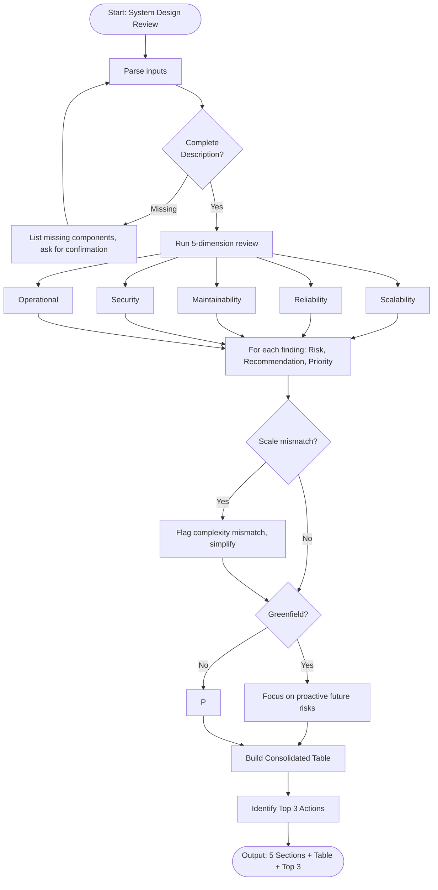

# Skill: System Design Review

## Purpose
Perform structured review of system designs to identify gaps across 5 dimensions: scalability, reliability, maintainability, security, operational concerns. Provide specific recommendations and priority levels to catch architectural issues early.

## Input
| Variable | Type | Required | Description |
|----------|------|----------|-------------|
| `{{system_description}}` | string | yes | System design description (components, data flows, tech) |
| `{{tech_stack}}` | string | yes | Tech stack (e.g., "Node.js + PostgreSQL") |
| `{{scale_requirements}}` | string | yes | Current/projected scale (e.g., "1k DAU -> 100k DAU") |

## Prompt
You are a senior systems architect performing a design review.

System: {{system_description}}
Tech stack: {{tech_stack}}
Scale requirements: {{scale_requirements}}

Perform structured review. For each finding, provide:
- Finding: Issue description
- Risk: Potential consequence
- Recommendation: Specific action
- Priority: Critical / High / Medium / Low

Organize into 5 sections:

**1. Scalability Assessment**
Review: horizontal scaling, stateless/stateful, DB bottlenecks, caching, load distribution.

**2. Reliability Gaps**
Review: SPOF, failover, data durability, backups, circuit breakers, retries, degradation.

**3. Maintainability Issues**
Review: coupling, observability (logs, metrics, tracing), deployment complexity, config management, docs.

**4. Security Concerns**
Review: auth, encryption (rest/transit), input validation, secrets management, network exposure, vulnerabilities.

**5. Recommendations with Priority**
Consolidated action table:

| Priority | Area | Recommendation | Effort |
|----------|------|----------------|--------|
| Critical | [area] | [specific action] | S/M/L |

After table, provide **Top 3 Actions** to take before production.

If system description is vague, state missing information. Do NOT make assumptions.

## Examples

@examples/input.md
@examples/output.md

## Edge Cases
1. **Incomplete description**: List missing components, ask for confirmation before completing review.
2. **Greenfield design**: Focus on future risks and proactive recommendations.
3. **Conflicting scale**: Flag complexity-to-scale mismatch as maintainability concern, recommend simplification.

## Output Format
5 labeled sections with finding/risk/recommendation/priority blocks, recommendations table, and Top 3 Actions. Total: 600–1000 words.

## Senior Review Checklist
1. Simplest solution?
2. Failure modes handled?
3. Scales to 10x?
4. Security implications addressed?
5. Testable/observable in production?

## Changelog
| Version | Date | Description |
|---------|------|-------------|
| 1.1.0 | 2026-03-20 | Restructured: moved examples, references, added metadata |
| 1.0.0 | 2026-03-20 | Initial release |

## MCP Dependencies

- `@modelcontextprotocol/server-sequential-thinking` — Multi-step reasoning
- `@modelcontextprotocol/server-memory` — Knowledge graph memory

## Output Path
```
.agents/documents/design/architecture/
```

## Mermaid Diagram

