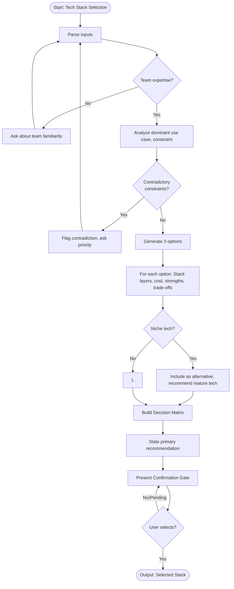

# Skill: Tech Stack Selection

## Purpose
Recommend technology stacks based on project types and constraints. Produce primary recommendation, two alternatives, decision matrix, and migration paths. Enable defensible technology decisions over hype.

## Input
| Variable | Type | Required | Description |
|----------|------|----------|-------------|
| `{{project_type}}` | string | yes | Project type (e.g., "B2B SaaS API", "mobile app") |
| `{{requirements}}` | string | yes | Functional/non-functional requirements |
| `{{constraints}}` | string | yes | Hard constraints (budget, timeline, team) |

## Prompt
> **Anti-Hallucination:** Follow `.agents/rules/anti-hallucination.md`. Show chain-of-thought. State assumptions. Say "I don't know" if uncertain. Use only provided context.

You are a senior software architect helping a team select a technology stack.

Project type: {{project_type}}
Requirements: {{requirements}}
Constraints: {{constraints}}

Present **3 complete end-to-end stack options**, then wait for user selection.

---

**Step 1 — Analyze Requirements**
State:
- Dominant use case (API-heavy, real-time, etc.)
- Most important constraint
- Contradictory constraints (flag, ask for priority)

---

**Step 2 — Present 3 Stack Options**
For each option:

```
Option [A/B/C]: [Stack Name]

Layer         | Technology
--------------|---------------------------
Frontend      | [framework + UI library]
Backend       | [language + framework]
Database      | [primary DB + cache if needed]
Auth          | [auth solution]
File Storage  | [storage solution]
Hosting       | [platform + deployment model]
CI/CD         | [pipeline tool]
Monitoring    | [observability tool]

Best for      : [1-line use case fit]
Team fit      : [skill level required]
Time to MVP   : [rough estimate]
Monthly cost  : [rough estimate at MVP scale]

Strengths     :
  - [strength 1]
  - [strength 2]

Trade-offs    :
  - [trade-off 1]
  - [trade-off 2]
```

---

**Step 3 — Decision Matrix**
Score options against requirements/constraints:

| Criterion | Weight | Option A | Option B | Option C |
|-----------|--------|----------|----------|----------|
| [Criterion] | [%] | [1–5] | [1–5] | [1–5] |
| Weighted Total | 100% | [score] | [score] | [score] |

---

**Step 4 — Recommendation**
State recommended option and why in 2–3 sentences. Reference matrix score and key constraint.

---

**Step 5 — Confirmation Gate**
End with this prompt:

> "Here are 3 end-to-end tech stack options for your project. Please choose one:
> - **A** — [Stack Name A]
> - **B** — [Stack Name B]
> - **C** — [Stack Name C]
> - **Custom** — specify your own combination
>
> Or specify which layer you'd like to change (e.g., 'A but switch database to MongoDB')"

**Do NOT proceed until user explicitly selects stack.**

## Examples

@examples/input.md
@examples/output.md

## Edge Cases
1. **Contradictory constraints**: Flag contradiction, explain trade-off, ask for priority.
2. **Missing team expertise**: Ask about team familiarity before recommending.
3. **Niche/emerging tech requested**: Include as alternative, recommend mature option as primary with production readiness reasoning.

## Output Format
5 numbered steps. Step 2 uses structured table. Step 3 uses markdown matrix. Steps 1, 4, 5 use prose. Step 5 must end with exact confirmation prompt. Total: 600–1000 words.

## Senior Review Checklist
1. Simplest solution?
2. Failure modes handled?
3. Scales to 10x?
4. Security implications addressed?
5. Testable/observable in production?

## Changelog
| Version | Date | Description |
|---------|------|-------------|
| 1.1.0 | 2026-03-20 | Restructured: moved examples, references, added metadata |
| 1.0.0 | 2026-03-20 | Initial release |

## MCP Dependencies

- `@modelcontextprotocol/server-sequential-thinking` — Multi-step reasoning
- `@upstash/context7-mcp` — Library docs/examples

## Output Path
```
.agents/documents/decisions/
```

## Mermaid Diagram

