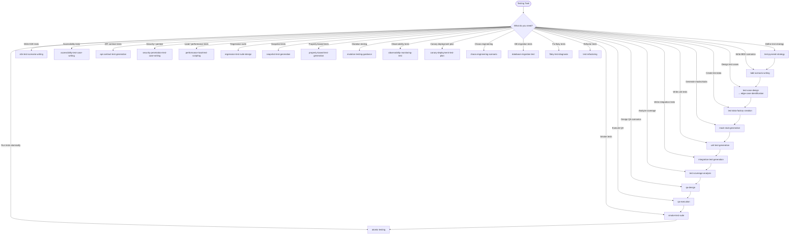

# Skills: Testing (27 skills)

This category contains skills for writing tests, testing strategies, and quality assurance.

## Subdirectory Structure

Each skill in the `testing` category has the following structure:

```
{skill-name}/
├── SKILL.md          # Core instructions (≤500 lines)
├── scripts/          # Test runner scripts and automation
│   ├── README.md
│   └── run-tests.sh
├── references/       # Supporting technical documentation
│   ├── README.md
│   └── compatibility-matrix.md
├── assets/           # Testing configuration templates
│   └── template.md
└── examples/         # Concrete input/output examples
    ├── input.md
    └── output.md
```

## Skills

| Skill | Description |
|-------|-------------|
| `accessibility-test-case-writing` | Write accessibility test cases |
| `api-contract-test-generation` | Generate API contract tests |
| `atomic-testing` | Run tests file-by-file with automated failure recovery |
| `bdd-scenario-writing` | Write BDD scenarios (Gherkin) |
| `canary-deployment-test-plan` | Plan canary deployment tests |
| `chaos-engineering-scenario` | Design chaos engineering scenarios |
| `database-migration-test` | Test database migrations |
| `e2e-test-scenario-writing` | Write E2E test scenarios |
| `edge-case-identification` | Identify edge cases |
| `flaky-test-diagnosis` | Diagnose flaky tests |
| `integration-test-generation` | Generate integration tests |
| `mock-stub-generation` | Generate mocks and stubs |
| `mutation-testing-guidance` | Guide mutation testing |
| `observability-monitoring-test` | Test observability and monitoring |
| `performance-load-test-scripting` | Script performance/load tests |
| `property-based-test-generation` | Generate property-based tests |
| `qa-design` | Design structured test scenarios (Positive/Negative/Monkey/Security) |
| `qa-execution` | Execute tests and produce structured bug reports |
| `regression-test-suite-design` | Design regression test suites |
| `security-penetration-test-case-writing` | Write penetration testing test cases |
| `smoke-test-suite` | Design smoke test suites |
| `snapshot-test-generation` | Generate snapshot tests |
| `test-case-design` | Design test cases |
| `test-coverage-analysis` | Analyze test coverage |
| `test-data-factory-creation` | Create test data factories |
| `test-pyramid-strategy` | Define test pyramid strategy |
| `test-refactoring` | Refactor existing tests |
| `unit-test-generation` | Generate unit tests |

---

## Mermaid Diagram


