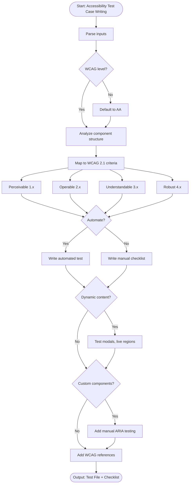

# Skill: Accessibility Test Case Writing

## Purpose
Generate accessibility test cases verifying UI compliance with WCAG 2.1 AA standards. Produces automated (axe-core) and manual (screen reader/keyboard) tests.

## Input
| Variable | Type | Req | Description |
|----------|------|-----|-------------|
| `component_or_page` | string | Yes | Target UI to test |
| `tech_stack` | string | Yes | e.g., "React + jest-axe" |
| `wcag_level` | string | No | "A", "AA", or "AAA" (default: AA) |

## Instructions
- **Coverage**: Address Perceivable (contrast, alt text), Operable (keyboard, focus), Understandable (labels, errors), and Robust (ARIA) criteria.
- **Automation**: Write axe-core or Playwright tests for detectable violations.
- **Manual Checklist**: Include screen reader and keyboard navigation verification steps.
- **References**: Map every test to a specific WCAG criterion.
- **Components**: Handle dynamic content (modals, toasts) and custom ARIA widgets.

## Edge Cases
| Case | Strategy |
|------|----------|
| Dynamic content | Test modals, toasts, and live regions for focus/announcements. |
| Custom widgets | Apply manual ARIA verification for custom non-native elements. |
| Third-party | Identify violations; provide workarounds or upstream reports. |

## Workflow

## Examples
- [Input Example](@examples/input.md)
- [Output Example](@examples/output.md)

## Quality Gate
- [ ] Automated axe-core tests included.
- [ ] Keyboard navigation fully tested.
- [ ] ARIA attributes verified.
- [ ] Manual checklist provided.
- [ ] WCAG criteria referenced.

## Changelog
| Version | Date | Description |
|---------|------|-------------|
| 1.1.0 | 2026-03-20 | Restructured: moved examples, references, added metadata |
| 1.0.0 | 2026-03-20 | Initial release |
