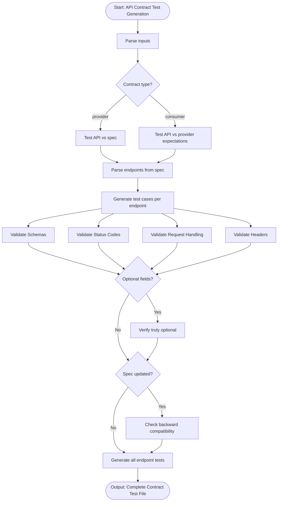

# Skill: API Contract Test Generation

## Purpose
Generate tests verifying API implementations match OpenAPI specs. Validates schemas, status codes, headers, and types to prevent contract breakage.

## Input
| Variable | Type | Req | Description |
|----------|------|-----|-------------|
| `api_spec` | string | Yes | OpenAPI spec (YAML/JSON) |
| `tech_stack` | string | Yes | e.g., "Node.js + Supertest" |
| `contract_type` | string | No | "provider" or "consumer" (default: provider) |

## Instructions
- **Response Validation**: Verify required fields, types (string/int), formats (uuid/date), and enums.
- **Status Codes**: Match exact spec codes for success (2xx) and error (4xx/5xx) paths.
- **Request Handling**: Enforce required fields and validate query/header constraints.
- **Headers**: Verify `Content-Type`, CORS, and authentication headers.
- **Schema Validation**: Use JSON Schema validation against the exact spec definition.
- **Backward Compatibility**: Ensure spec updates don't break existing consumers.

## Edge Cases
| Case | Strategy |
|------|----------|
| Spec Drift | Treat spec as the absolute source of truth. |
| Optional fields | Explicitly verify that optional fields do not cause failure when omitted. |
| Breaking changes | Flag backward-compatibility issues during generation. |

## Workflow

## Examples
- [Input Example](@examples/input.md)
- [Output Example](@examples/output.md)

## Quality Gate
- [ ] Response schemas validated.
- [ ] Required fields enforced.
- [ ] Field types/formats validated.
- [ ] Error response schemas included.
- [ ] Undocumented fields detected.

## Changelog
| Version | Date | Description |
|---------|------|-------------|
| 1.1.0 | 2026-03-20 | Restructured: moved examples, references, added metadata |
| 1.0.0 | 2026-03-20 | Initial release |
