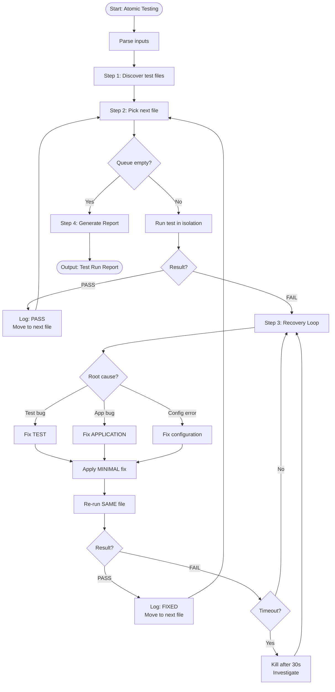

# Skill: Atomic Testing

## Purpose
Orchestrates deterministic, per-file testing. Ensures every test file passes in isolation; enters recovery loops on failure to analyze and fix.

## Input
| Variable | Type | Req | Description |
|----------|------|-----|-------------|
| `test_directory` | string | Yes | Root test directory (e.g., `tests/`) |
| `test_runner` | string | Yes | Test command (e.g., `pytest`, `jest`) |
| `scope` | string | No | Subdirectory or pattern limit |

## Instructions
- **Discovery**: Scan `test_directory` for matching files and build execution queue.
- **Isolated Execution**: Run `test_runner` on each file individually.
- **Recovery Loop**: On failure:
  1. Identify root cause (Test vs App bug).
  2. Apply minimal fix to the CORRECT location (never both).
  3. Re-run until passing.
- **Reporting**: Summarize passed/failed/fixed counts and architectural failure patterns.
- **Constraint**: NEVER skip failing files; NEVER disable assertions.

## Edge Cases
| Case | Strategy |
|------|----------|
| Total Failure | Check global configuration or environment setup first. |
| Missing File | Verify path patterns and runner config. |
| Infinite Loop | Kill after 30s; mark timeout; investigate async issues. |

## Workflow

## Quality Gate
- [ ] Failures analyzed before fixes.
- [ ] Fixes are minimal and targeted.
- [ ] No skipped tests in final run.
- [ ] Fixes committed separately.
- [ ] Run report is accurate.

## Changelog
| Version | Date | Description |
|---------|------|-------------|
| 1.1.0 | 2026-03-20 | Restructured: moved examples, references, added fields |
| 1.0.0 | 2026-03-20 | Initial release |
