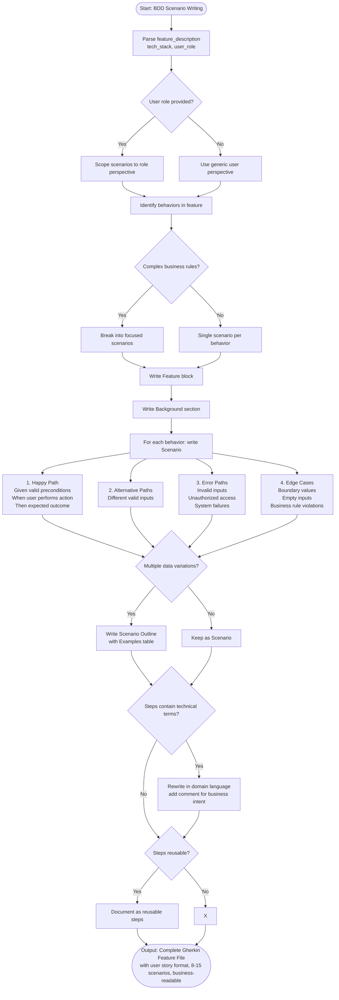

# Skill: BDD Scenario Writing

## Purpose
Generate BDD scenarios in Gherkin format for features and user stories to bridge business requirements and implementation.

## Input
| Variable | Type | Req | Description |
|----------|------|-----|-------------|
| `feature_description` | string | Yes | Target feature or user story |
| `tech_stack` | string | Yes | e.g., "Node.js + Cucumber" |
| `user_role` | string | No | Primary user persona |

## Instructions
- **Gherkin Syntax**: Use standard Feature, Background, Scenario, and Scenario Outline blocks.
- **Business Language**: Write in domain-specific, non-technical language from the user perspective.
- **Scenarios**: Cover happy paths, alternatives, errors, edge cases, and business rules.
- **Variations**: Use `Scenario Outline` with `Examples` tables for data-driven tests.
- **Atoms**: Ensure each scenario tests exactly one behavior and is independent.
- **Step Hints**: Suggest patterns for reusable step definitions.

## Edge Cases
| Case | Strategy |
|------|----------|
| Complex rules | Break into multiple focused, atomic scenarios. |
| Technical steps | Rewrite in domain language; add comment explaining business intent. |
| Shared steps | Identify and document as reusable step definitions. |

## Workflow

## Examples
- [Input Example](@examples/input.md)
- [Output Example](@examples/output.md)

## Quality Gate
- [ ] Scenarios in business language.
- [ ] One behavior per scenario.
- [ ] All business rules covered.
- [ ] Scenario Outlines used for data variations.
- [ ] Understandable by non-technical stakeholders.

## Changelog
| Version | Date | Description |
|---------|------|-------------|
| 1.1.0 | 2026-03-20 | Restructured examples and references, added metadata |
| 1.0.0 | 2026-03-20 | Initial release |
