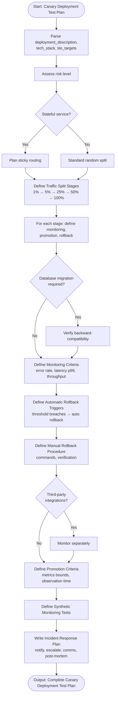

# Skill: Canary Deployment Test Plan

## Purpose
Design a plan for gradual rollout to limited user subsets. Produces traffic split strategies, monitoring criteria, and rollback triggers.

## Input
| Variable | Type | Req | Description |
|----------|------|-----|-------------|
| `deployment_description` | string | Yes | Change description and risk level |
| `tech_stack` | string | Yes | e.g., "Kubernetes + Istio" |
| `slo_targets` | string | Yes | e.g., "p99 < 500ms" |

## Instructions
- **Traffic Strategy**: Define stages (e.g., 1% → 5% → 25%), stage duration, and targeting (random/segment).
- **Monitoring**: Specify key metrics (error rate, latency) with statistical significance requirements.
- **Rollback**: Define automated triggers (threshold breaches) and manual procedures with recovery targets.
- **Promotion**: Set metric bounds and minimum observation times for stage progression.
- **Implementation**: Provide exact CLI commands for the specific stack.
- **Incident Response**: Define notification paths and communication templates.

## Edge Cases
| Case | Strategy |
|------|----------|
| Stateful services | Apply sticky routing to ensure users stay on the same version. |
| DB Migrations | Verify backward-compatibility before starting rollout. |
| Third-party | Monitor external API errors separately from internal ones. |

## Workflow

## Examples
- [Input Example](@examples/input.md)
- [Output Example](@examples/output.md)

## Quality Gate
- [ ] Gradual traffic stages defined.
- [ ] Automatic rollback triggers included.
- [ ] Procedure for manual rollback documented.
- [ ] Business metrics monitored.
- [ ] Communication plan provided.

## Changelog
| Version | Date | Description |
|---------|------|-------------|
| 1.1.0 | 2026-03-20 | Restructured: examples/references moved, metadata added |
| 1.0.0 | 2026-03-20 | Initial release |
