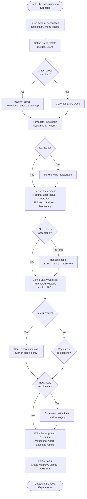

# Skill: Chaos Engineering Scenario

## Purpose
Design experiments for deliberate failure injection to test system resilience and recovery mechanisms.

## Input
| Variable | Type | Req | Description |
|----------|------|-----|-------------|
| `system_description` | string | Yes | Arch/components (e.g., "K8s + Node") |
| `tech_stack` | string | Yes | Target technology stack |
| `chaos_scope` | string | No | network, compute, app (default: all) |

## Instructions
- **Steady State**: Define normal behavior metrics (error rate, latency) and SLOs.
- **Hypotheses**: Formulate falsifiable statements focusing on resilience mechanisms.
- **Experiment Design**: Specify failure type, blast radius (1 pod/AZ), duration, and rollback abort criteria.
- **Failure Types**: Test network (latency), compute (OOM), storage (disk full), and app (crash) scenarios.
- **Safety**: Start with smallest radius; monitor SLOs; run during low-traffic periods.
- **Implementation**: Provide step-by-step instructions for tools (Chaos Monkey, Litmus, FIS).

## Edge Cases
| Case | Strategy |
|------|----------|
| Production | Always start in staging; validate extensively before prod execution. |
| Stateful | Explicitly avoid experiments that risk data loss/corruption. |
| Compliance | Document regulatory restrictions for finance/healthcare sectors. |

## Workflow

## Examples
- [Input Example](@examples/input.md)
- [Output Example](@examples/output.md)

## Quality Gate
- [ ] Steady state defined with measurable metrics.
- [ ] Clear hypothesis per experiment.
- [ ] Blast radius and rollback defined.
- [ ] Abort criteria specified.
- [ ] Realistic schedule provided.

## Changelog
| Version | Date | Description |
|---------|------|-------------|
| 1.1.0 | 2026-03-20 | Restructured: moved examples, references, added metadata |
| 1.0.0 | 2026-03-20 | Initial release |
