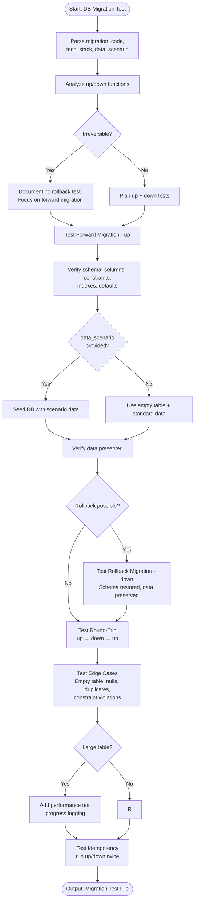

# Skill: Database Migration Test

## Purpose
Generate tests verifying that forward migrations apply correctly, rollbacks restore previous state, and data integrity is maintained.

## Input
| Variable | Type | Req | Description |
|----------|------|-----|-------------|
| `migration_code` | string | Yes | Migration file(s) (up/down) |
| `tech_stack` | string | Yes | e.g., "Node.js + Knex + Postgres" |
| `data_scenario` | string | No | Existing data scenario |

## Instructions
- **Forward Migration**: Verify new schema, column types, constraints, indexes, and default values.
- **Rollback**: Verify schema restoration and idempotency; ensure rollback doesn't crash.
- **Data Integrity**: Verify that existing data survives transformations and that constraints (FK) are enforced.
- **Edge Cases**: Test empty tables, nulls, duplicates on new unique constraints, and maximum row counts.
- **Idempotency**: Ensure running `up` or `down` twice in a row does not cause errors.
- **Lifecycle**: For every test: setup state → run migration → assert post-state → clean up.

## Edge Cases
| Case | Strategy |
|------|----------|
| Irreversible | Document impossibility of rollback; focus entirely on forward verification. |
| Large tables | Test performance/duration; add progress logging assertions. |
| Zero-downtime | Test migration behavior during simulated concurrent traffic. |

## Workflow

## Examples
- [Input Example](@examples/input.md)
- [Output Example](@examples/output.md)

## Quality Gate
- [ ] Both forward and rollback migrations tested.
- [ ] Existing data preservation verified.
- [ ] Constraint violations tested.
- [ ] Round-trip (up-down-up) tested.
- [ ] Edge cases (empty/large tables) covered.

## Changelog
| Version | Date | Description |
|---------|------|-------------|
| 1.1.0 | 2026-03-20 | Restructured: moved examples, references, added metadata |
| 1.0.0 | 2026-03-20 | Initial release |
