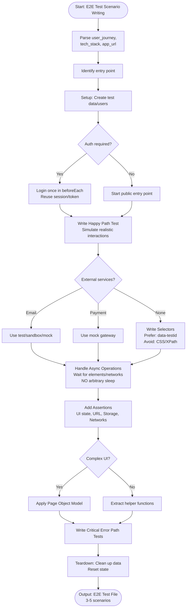

# Skill: E2E Test Scenario Writing

## Purpose
Generate end-to-end test scenarios simulating real user journeys through the application UI to verify completeness.

## Input
| Variable | Type | Req | Description |
|----------|------|-----|-------------|
| `user_journey` | string | Yes | e.g., "Signup, verify, complete profile" |
| `tech_stack` | string | Yes | e.g., "React + Playwright" |
| `app_url` | string | No | Base URL (default: http://localhost:3000) |

## Instructions
- **Flows**: Simulate full interactions (click, type, navigate); verify completion and handle critical errors.
- **Selectors**: Prefer `data-testid` and semantic roles; avoid brittle CSS/XPath.
- **Async**: Use explicit waits for elements/network; NO arbitrary `sleep()`.
- **Verification**: Check UI states, URL changes, auth tokens, and network payloads.
- **Lifecycle**: Perform setup (create data/users) and teardown (cleanup/reset) around tests.
- **Structure**: Apply Page Object Model for complex UIs; extract common helper actions.

## Edge Cases
| Case | Strategy |
|------|----------|
| Auth | Create test users in `beforeEach`; reuse session tokens; avoid redundant logins. |
| External | Use sandbox accounts or mocks for email/payment services. |
| Flaky UI | Use Page Object Model to centralize selector management and improve stability. |

## Workflow

## Examples
- [Input Example](@examples/input.md)
- [Output Example](@examples/output.md)

## Quality Gate
- [ ] Selectors are robust (data-testid).
- [ ] Async operations use explicit waits.
- [ ] Test data cleaned up.
- [ ] Happy path and errors tested.
- [ ] Multi-point assertions included.

## Changelog
| Version | Date | Description |
|---------|------|-------------|
| 1.1.0 | 2026-03-20 | Restructured: moved examples, references, added metadata |
| 1.0.0 | 2026-03-20 | Initial release |
