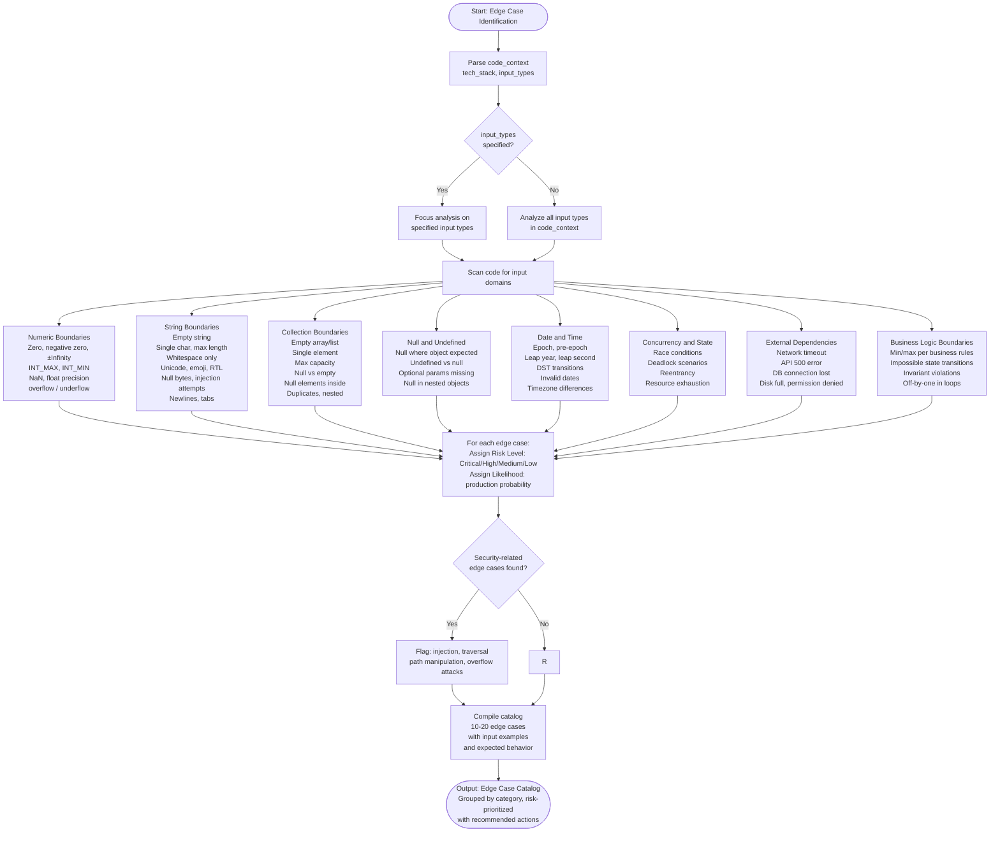

# Skill: Edge Case Identification

## Purpose
Systematically identifies edge cases, boundary conditions, and failure scenarios for a given function, api, or feature. it produces a comprehensive catalog of unusual, extreme, or unexpected inputs that could cause bugs, crashes, or incorrect behavior. the output helps developers write more robust code and comprehensive tests.

## Input
| Variable | Type | Required | Description |
|----------|------|----------|-------------|
| `{{code_context}}` | string | yes | The function, API endpoint, or feature specification to analyze |
| `{{tech_stack}}` | string | yes | Target technology stack (e.g., "Java + Spring Boot", "Go + Gin") |
| `{{input_types}}` | string | no | Specific input types to focus on (e.g., "strings, numbers, dates") |

## Prompt

Given this code or feature:
```
{{code_context}}
```

Tech stack: {{tech_stack}}
Input types: {{input_types}}

Systematically identify all edge cases, boundary conditions, and failure scenarios using these categories:

**1. Numeric Boundaries**
- Zero, negative zero, positive/negative infinity
- Maximum and minimum values for the data type (INT_MAX, INT_MIN, etc.)
- Just below minimum, just above maximum
- Floating point precision issues (0.1 + 0.2 ≠ 0.3)
- NaN (Not a Number)
- Very large numbers causing overflow
- Very small numbers causing underflow

**2. String Boundaries**
- Empty string ("")
- Single character
- Maximum length string
- String with only whitespace
- String with special characters: null bytes, unicode, emojis, RTL characters
- String with SQL/HTML/script injection attempts
- String with newlines, tabs, carriage returns
- String in different encodings (UTF-8, ASCII, Latin-1)

**3. Collection Boundaries**
- Empty array/list/set
- Single-element collection
- Collection at maximum capacity
- Null collection vs empty collection
- Collection with null elements
- Collection with duplicate elements
- Nested collections (array of arrays)

**4. Null and Undefined**
- Null input where object expected
- Undefined vs null (JavaScript/TypeScript)
- Optional parameters not provided
- Null in nested objects (obj.prop.subprop where prop is null)

**5. Date and Time Edge Cases**
- Epoch time (1970-01-01)
- Dates before epoch (negative timestamps)
- Leap years, leap seconds
- Daylight saving time transitions
- Different timezones
- Invalid dates (February 30, month 13)
- Date format parsing edge cases

**6. Concurrency and State**
- Race conditions (simultaneous access)
- Deadlock scenarios
- State changes during operation
- Reentrancy issues
- Resource exhaustion (connection pool, memory)

**7. External Dependencies**
- Network timeout
- API returns 500 error
- Database connection lost
- File system full
- Permission denied
- Service unavailable

**8. Business Logic Boundaries**
- Minimum and maximum allowed values per business rules
- State transitions that should be impossible
- Combinations of inputs that violate invariants
- Off-by-one errors in loops or ranges

For each edge case, provide:
- **Category**: Which category above
- **Edge Case**: Description of the scenario
- **Input Example**: Concrete example value
- **Expected Behavior**: What should happen (error, default, special handling)
- **Risk Level**: Critical / High / Medium / Low
- **Likelihood**: How likely this is to occur in production

## Examples

@examples/input.md
@examples/output.md

## Input Boundary Cases
1. File exactly 50MB — should succeed (boundary)
2. File 50MB + 1 byte — should reject with 413
3. Empty file (0 bytes) — reject with 400

## File Type Cases
4. Valid PDF with wrong extension (.pdf renamed to .exe) — MIME sniff should catch
5. Polyglot file (valid PDF + embedded ZIP) — malware scanner should flag
6. Corrupted PDF header — reject with 422

## Concurrency Cases
7. Same user uploads 10 files simultaneously — rate limit should apply
8. S3 upload timeout mid-transfer — cleanup temp file, return 503

## Security Cases
9. Filename with path traversal: `../../etc/passwd.pdf` — sanitize filename
10. Zip bomb disguised as DOCX — size limit after decompression
```

## Numeric Boundaries

**Edge Case 1: Age is exactly 18 (lower boundary)**
- **Category**: Numeric Boundaries
- **Input Example**: `age = 18`
- **Expected Behavior**: Should return `true` (inclusive boundary)
- **Risk Level**: High
- **Likelihood**: High (common legal age)

**Edge Case 2: Age is 17 (just below lower boundary)**
- **Category**: Numeric Boundaries
- **Input Example**: `age = 17`
- **Expected Behavior**: Should return `false`
- **Risk Level**: High
- **Likelihood**: High

**Edge Case 3: Age is exactly 120 (upper boundary)**
- **Category**: Numeric Boundaries
- **Input Example**: `age = 120`
- **Expected Behavior**: Should return `true` (inclusive boundary)
- **Risk Level**: Medium
- **Likelihood**: Low (rare but possible)

**Edge Case 4: Age is 121 (just above upper boundary)**
- **Category**: Numeric Boundaries
- **Input Example**: `age = 121`
- **Expected Behavior**: Should return `false`
- **Risk Level**: Medium
- **Likelihood**: Low

**Edge Case 5: Age is zero**
- **Category**: Numeric Boundaries
- **Input Example**: `age = 0`
- **Expected Behavior**: Should return `false`
- **Risk Level**: High
- **Likelihood**: Medium (data entry error)

**Edge Case 6: Age is negative**
- **Category**: Numeric Boundaries
- **Input Example**: `age = -5`
- **Expected Behavior**: Should return `false`
- **Risk Level**: High
- **Likelihood**: Medium (data corruption or malicious input)

**Edge Case 7: Age is a decimal**
- **Category**: Numeric Boundaries
- **Input Example**: `age = 18.5`
- **Expected Behavior**: Should handle gracefully (round down, reject, or accept)
- **Risk Level**: Medium
- **Likelihood**: Medium (user enters "18.5 years old")

**Edge Case 8: Age is NaN**
- **Category**: Numeric Boundaries
- **Input Example**: `age = NaN`
- **Expected Behavior**: Should return `false` or throw error
- **Risk Level**: Critical
- **Likelihood**: High (result of invalid parsing)

**Edge Case 9: Age is Infinity**
- **Category**: Numeric Boundaries
- **Input Example**: `age = Infinity`
- **Expected Behavior**: Should return `false`
- **Risk Level**: Medium
- **Likelihood**: Low (division by zero upstream)

**Edge Case 10: Age is null (type coercion)**
- **Category**: Null and Undefined
- **Input Example**: `age = null as any`
- **Expected Behavior**: TypeScript should catch at compile time, but runtime should reject
- **Risk Level**: High
- **Likelihood**: Medium (API receives null from client)

**Edge Case 11: Age is undefined**
- **Category**: Null and Undefined
- **Input Example**: `age = undefined as any`
- **Expected Behavior**: Should reject or throw error
- **Risk Level**: High
- **Likelihood**: Medium (missing parameter)

**Edge Case 12: Age is a string that looks like a number**
- **Category**: Type Coercion
- **Input Example**: `age = "25" as any`
- **Expected Behavior**: TypeScript prevents this, but JavaScript would coerce. Should validate type.
- **Risk Level**: High
- **Likelihood**: High (API receives string from query param)

## Summary
- **Total Edge Cases Identified**: 12
- **Critical Risk**: 1
- **High Risk**: 8
- **Medium Risk**: 3
- **Recommended Actions**:
  1. Add explicit type guard: `if (typeof age !== 'number' || isNaN(age))`
  2. Add range validation before comparison
  3. Document whether decimals are allowed
  4. Add unit tests for all 12 edge cases
```

### Example 2: Python + FastAPI — File Upload Endpoint
**Input:**
- `{{code_context}}`:
```python
@app.post("/upload")
async def upload_file(file: UploadFile):
    content = await file.read()
    with open(f"uploads/{file.filename}", "wb") as f:
        f.write(content)
    return {"filename": file.filename}
```
- `{{tech_stack}}`: "Python + FastAPI"

**Output:**
```markdown
# Edge Cases: File Upload Endpoint

## String Boundaries (Filename)

**Edge Case 1: Empty filename**
- **Category**: String Boundaries
- **Input Example**: `filename = ""`
- **Expected Behavior**: Should reject with error "Filename cannot be empty"
- **Risk Level**: High
- **Likelihood**: Medium

**Edge Case 2: Filename with path traversal**
- **Category**: Security
- **Input Example**: `filename = "../../etc/passwd"`
- **Expected Behavior**: Should sanitize or reject
- **Risk Level**: Critical
- **Likelihood**: High (common attack vector)

**Edge Case 3: Filename with special characters**
- **Category**: String Boundaries
- **Input Example**: `filename = "file<>:\"|?*.txt"`
- **Expected Behavior**: Should sanitize invalid filesystem characters
- **Risk Level**: High
- **Likelihood**: Medium

**Edge Case 4: Very long filename**
- **Category**: String Boundaries
- **Input Example**: `filename = "a" * 300 + ".txt"` (300 characters)
- **Expected Behavior**: Should reject or truncate (filesystem limit ~255 chars)
- **Risk Level**: Medium
- **Likelihood**: Low

**Edge Case 5: Filename with unicode/emoji**
- **Category**: String Boundaries
- **Input Example**: `filename = "file_😀_测试.txt"`
- **Expected Behavior**: Should handle or sanitize
- **Risk Level**: Medium
- **Likelihood**: Medium

## File Content Boundaries

**Edge Case 6: Empty file (0 bytes)**
- **Category**: Collection Boundaries
- **Input Example**: File with `len(content) = 0`
- **Expected Behavior**: Should accept or reject based on business rules
- **Risk Level**: Medium
- **Likelihood**: High

**Edge Case 7: Very large file**
- **Category**: Resource Limits
- **Input Example**: File with 5GB size
- **Expected Behavior**: Should reject with "File too large" (set max size limit)
- **Risk Level**: Critical
- **Likelihood**: High (DoS attack or user error)

**Edge Case 8: File with null bytes**
- **Category**: String Boundaries
- **Input Example**: Content contains `\x00`
- **Expected Behavior**: Should handle binary data correctly
- **Risk Level**: Medium
- **Likelihood**: Medium

## External Dependencies

**Edge Case 9: Disk full**
- **Category**: External Dependencies
- **Input Example**: Filesystem has 0 bytes free
- **Expected Behavior**: Should catch OSError and return 507 Insufficient Storage
- **Risk Level**: Critical
- **Likelihood**: Medium

**Edge Case 10: Permission denied**
- **Category**: External Dependencies
- **Input Example**: `uploads/` directory is read-only
- **Expected Behavior**: Should catch PermissionError and return 500
- **Risk Level**: High
- **Likelihood**: Low

**Edge Case 11: Filename collision**
- **Category**: Business Logic
- **Input Example**: File with same name already exists
- **Expected Behavior**: Should overwrite, rename, or reject based on business rules
- **Risk Level**: High
- **Likelihood**: High

## Concurrency

**Edge Case 12: Simultaneous uploads of same filename**
- **Category**: Concurrency
- **Input Example**: Two requests upload "file.txt" at same time
- **Expected Behavior**: Should handle race condition (atomic write or locking)
- **Risk Level**: High
- **Likelihood**: Medium

## Summary
- **Total Edge Cases**: 12
- **Critical Risk**: 2
- **High Risk**: 7
- **Recommended Actions**:
  1. Add filename sanitization (remove path traversal, special chars)
  2. Add file size limit (e.g., 10MB max)
  3. Add disk space check before write
  4. Use unique filenames (UUID) to prevent collisions
  5. Add comprehensive error handling for filesystem operations
```

## Edge Cases
- **Pure functions with no I/O**: Focus on numeric boundaries, null handling, and type coercion
- **Stateful systems**: Emphasize concurrency, race conditions, and state transition edge cases
- **External API integrations**: Focus on timeout, error responses, rate limiting, and network failures

## Output Format
A structured markdown document with:
- Edge cases grouped by category
- 10-20 edge cases identified
- Each edge case with input example, expected behavior, risk level, likelihood
- Summary with risk distribution and recommended actions
- 600-1000 words total

## Senior Review Checklist
- [ ] Are all numeric boundaries covered (zero, negative, max, min, NaN, Infinity)?
- [ ] Are null and undefined cases identified?
- [ ] Are security-related edge cases (injection, traversal) included?
- [ ] Are external dependency failures considered?
- [ ] Is each edge case assigned a realistic risk level and likelihood?

## Changelog
| Version | Date | Description |
|---------|------|-------------|
| 1.1.0 | 2026-03-20 | Restructured: moved examples to examples/, references to references/, added compatibility and license fields |
| 1.0.0 | 2026-03-20 | Initial release |

## Output Path

Save generated documents to:

```
.agents/documents/application/testing/{module-slug}/
```

## Mermaid Diagram


