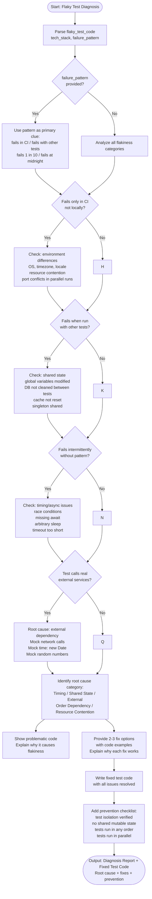

# Skill: Flaky Test Diagnosis

## Purpose
Diagnose root causes of intermittent test failures (flakiness) and provide targeted synchronization or isolation fixes.

## Input
| Variable | Type | Req | Description |
|----------|------|-----|-------------|
| `flaky_test_code` | string | Yes | Code and observed errors |
| `tech_stack` | string | Yes | e.g., "Node.js + Jest" |
| `failure_pattern` | string | No | e.g., "fails only in CI" |

## Instructions
- **Category Check**: Analyze for Timing (race, missing await), Shared State (global var, DB leakage), External Deps (network, time), Order Dependency, or Resource Contention (ports, memory).
- **Diagnosis**: Explain the root cause; show problematic code vs. fixed code.
- **Remediation**:
  - Replace `sleep()` with proper async waits.
  - Implement database transaction rollbacks.
  - Mock external services, time, and random numbers.
  - Reset singletons/caches in `beforeEach`.
- **Hardening**: Add a prevention checklist (no shared mutable state, run-in-any-order).
- **Verification**: Ensure tests are self-contained (Arrange/Act/Assert/Cleanup).

## Edge Cases
| Case | Strategy |
|------|----------|
| Network | Always mock external API calls; do not rely on live services. |
| Time | Mock `Date.now()` or `new Date()` to avoid midnight/boundary failures. |
| Parallel | Check for port conflicts or shared resource locks when running in parallel. |

## Workflow

## Examples
- [Input Example](@examples/input.md)
- [Output Example](@examples/output.md)

## Quality Gate
- [ ] Root cause correctly identified.
- [ ] Fix addresses root cause, not symptom.
- [ ] Test isolation verified.
- [ ] Fix documented to prevent recurrence.
- [ ] Prevention checklist included.

## Changelog
| Version | Date | Description |
|---------|------|-------------|
| 1.1.0 | 2026-03-20 | Restructured: moved examples to examples/, references to references/, added compatibility and license fields |
| 1.0.0 | 2026-03-20 | Initial release |
