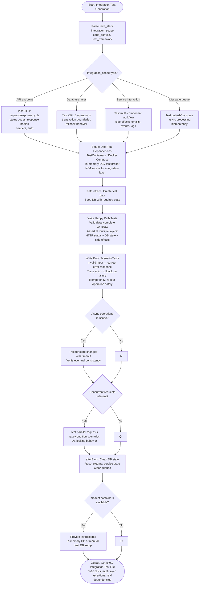

# Skill: Integration Test Generation

## Purpose
Generate tests verifying interactions between multiple components or services using real containers/databases.

## Input
| Variable | Type | Req | Description |
|----------|------|-----|-------------|
| `tech_stack` | string | Yes | e.g., "Node.js + Postgres" |
| `integration_scope` | string | Yes | Target: API, DB, or Service flow |
| `code_context` | string | Yes | Code or API spec |
| `test_framework` | string | No | e.g., "TestContainers" |

## Instructions
- **Dependencies**: Use real test databases or containers (e.g., TestContainers); avoid mocks for the integration layer.
- **Workflows**: Test request/response cycles, persistence across layers, and side effects (events, logs).
- **Isolation**: Ensure setup (seeding) and teardown (DB cleaning) occur per test to avoid state leakage.
- **Scenarios**: Cover happy paths, invalid inputs, concurrent requests, and idempotency.
- **Async**: Implement polling or waits for eventually consistent operations.
- **Asserts**: Verify status codes, DB state changes, and external side effects.

## Edge Cases
| Case | Strategy |
|------|----------|
| No Containers | Provide instructions for in-memory DBs or manual test DB setup. |
| External APIs | Use service virtualization or dedicated test accounts. |
| Long-running | Include polling logic with specific timeout thresholds. |

## Workflow

## Examples
- [Input Example](@examples/input.md)
- [Output Example](@examples/output.md)

## Quality Gate
- [ ] Real dependencies used (no mocks).
- [ ] DB state cleaned per test.
- [ ] Multi-layer assertions included.
- [ ] Rollback behavior tested.
- [ ] Concurrent scenarios considered.

## Changelog
| Version | Date | Description |
|---------|------|-------------|
| 1.1.0 | 2026-03-20 | Restructured: moved examples to examples/, references to references/, added compatibility and license fields |
| 1.0.0 | 2026-03-20 | Initial release |
