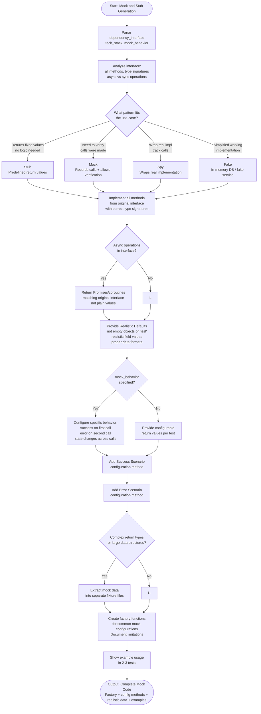

# Skill: Mock and Stub Generation

## Purpose
Generate mocks, stubs, or fakes for external dependencies to enable isolated unit testing with proper type safety.

## Input
| Variable | Type | Req | Description |
|----------|------|-----|-------------|
| `dependency_interface` | string | Yes | Interface/Class to mock |
| `tech_stack` | string | Yes | e.g., "TypeScript + Jest" |
| `mock_behavior` | string | No | e.g., "return success on call 1" |

## Instructions
- **Pattern Matching**: Implement all original interface methods using the correct pattern (Stub, Mock, Spy, or Fake).
- **Type Safety**: Ensure signatures match perfectly (TypeScript/Typed Python).
- **Realism**: Return data structures matching production format with realistic values, not just empty objects.
- **Async**: Properly handle `Promise` or `await` matching the original interface.
- **Configurability**: Support success/error scenarios and configurable return values per test.
- **Reusability**: Provide factory functions and extract mock data into fixtures.

## Edge Cases
| Case | Strategy |
|------|----------|
| Complex Types | Extract nested/large data into separate fixture files. |
| Stateful | Use `side_effect` or state variables to simulate behavior changes across calls. |
| Async | Ensure returned Promises resolve/reject as the original service would. |

## Workflow

## Examples
- [Input Example](@examples/input.md)
- [Output Example](@examples/output.md)

## Quality Gate
- [ ] Complete interface implemented.
- [ ] Type signatures are accurate.
- [ ] Success/Error scenarios supported.
- [ ] Realistic data values used.
- [ ] Factory functions provided.

## Changelog
| Version | Date | Description |
|---------|------|-------------|
| 1.1.0 | 2026-03-20 | Restructured: moved examples to examples/, references to references/, added compatibility and license fields |
| 1.0.0 | 2026-03-20 | Initial release |
