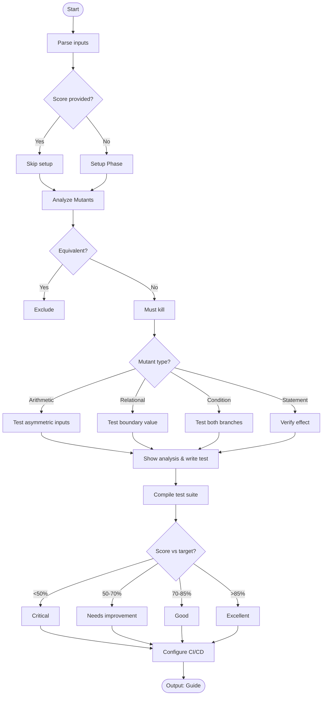

# Skill: Mutation Testing Guidance

## Purpose
Guides setup, interpretation, and elevation of test quality via mutation testing (Stryker, PITest).

## Input
| Variable | Type | Req | Description |
|----------|------|-----|-------------|
| `tech_stack` | string | Yes | e.g., "TypeScript + Stryker" |
| `code_context` | string | Yes | Target source code |
| `mutation_score` | string | No | Current survivors/score |

## Instructions
- **Concepts**: Explain mutation testing (Arithmetic/Relational operators) vs. raw coverage; define mutation score targets (70-85%).
- **Setup**: Provide tool installation and CI threshold configuration steps.
- **Analysis**: Categorize survivors (Equivalent mutants vs. real gaps); prioritize real logic gaps.
- **Killing Mutants**: Write specific tests to kill survivors; show before/after test comparisons.
- **Refinement**: Handle equivalent mutants by documenting and excluding them.
- **CI/CD**: Integrate thresholds to block PRs with poor mutation scores.

## Edge Cases
| Case | Strategy |
|------|----------|
| Equivalent | Mutants that behave like the original; document and exclude from score. |
| Slow Runs | Use incremental testing or limit mutation scope to changed files in CI. |
| High Score | If >85%, focus on other testing types (e.g., E2E) rather than killing edge survivors. |

## Workflow

## Examples
- [Input Example](@examples/input.md)
- [Output Example](@examples/output.md)

## Quality Gate
- [ ] Tool configuration provided.
- [ ] Survivors categorized correctly.
- [ ] Killing tests included for real gaps.
- [ ] Equivalent mutants addressed.
- [ ] CI thresholds defined.

## Changelog
| Version | Date | Description |
|---------|------|-------------|
| 1.1.0 | 2026-03-20 | Restructured: moved examples/references, added fields |
| 1.0.0 | 2026-03-20 | Initial release |
