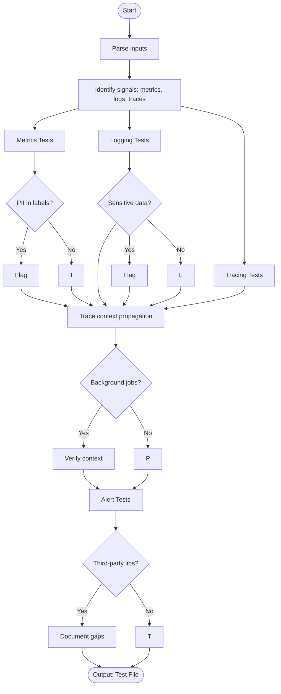

# Skill: Observability Monitoring Test

## Purpose
Verify that metrics, logs, and traces are correctly emitted and propagated to validate instrumentation setup.

## Input
| Variable | Type | Req | Description |
|----------|------|-----|-------------|
| `observability_setup` | string | Yes | Stack and scope |
| `tech_stack` | string | Yes | e.g., "Node.js + OpenTelemetry" |
| `instrumentation_code`| string | No | Current logic |

## Instructions
- **Metrics**: Verify counters increment, histograms record values, and labels are correct.
- **Logging**: Validate structured JSON format, levels, and exclusion of sensitive data (PII/tokens).
- **Tracing**: Confirm spans are created for key ops and context propagates across service boundaries.
- **Alerting**: Test that rules fire on thresholds and are actionable.
- **Async/Jobs**: Verify spans close properly and trace IDs persist in background jobs.
- **Gaps**: Document instrumentation missing from third-party libraries.

## Edge Cases
| Case | Strategy |
|------|----------|
| Async | Ensure context managers are used to verify spans close on completion. |
| Background | Verify trace propagation from parent context into worker/queue spans. |
| 3rd-party | Document gaps if libraries lack native OTel support. |

## Workflow

## Examples
- [Input Example](@examples/input.md)
- [Output Example](@examples/output.md)

## Quality Gate
- [ ] Spans verified for critical operations.
- [ ] Required span attributes present.
- [ ] Logs validated as structured JSON.
- [ ] PII absence confirmed.
- [ ] Cross-boundary context propagation tested.

## Changelog
| Version | Date | Description |
|---------|------|-------------|
| 1.1.0 | 2026-03-20 | Restructured: moved examples/references, added fields |
| 1.0.0 | 2026-03-20 | Initial release |
