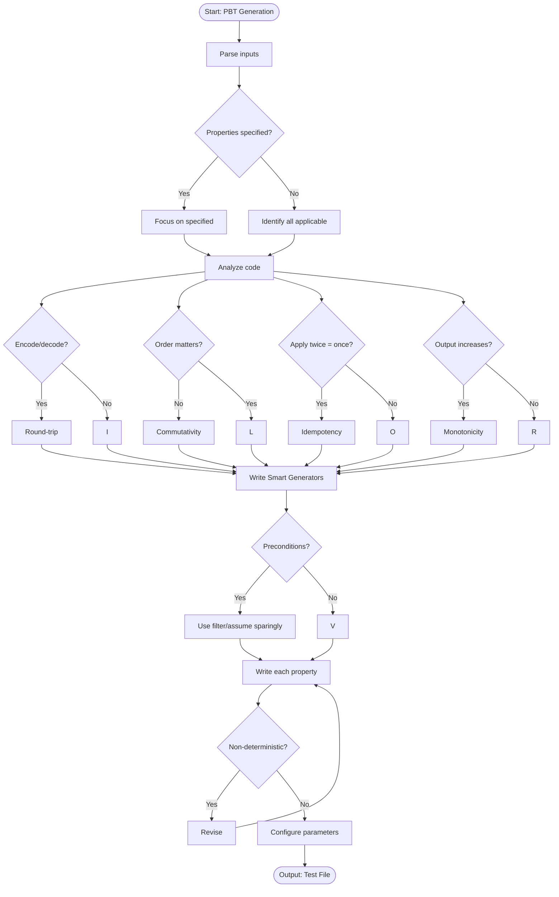

# Skill: Property-Based Test Generation

## Purpose
Generate tests to verify universal properties (Idempotency, Round-trip, Invariants) across randomly generated inputs to find edge cases.

## Input
| Variable | Type | Req | Description |
|----------|------|-----|-------------|
| `code_context` | string | Yes | Function/Module to test |
| `tech_stack` | string | Yes | e.g., "fast-check + TS" |
| `properties` | string | No | Specific target properties |

## Instructions
- **Identify Properties**: Focus on Idempotency, Commutativity, Identity, Inverses (Round-trip), and Monotonicity.
- **Smart Generators**: Write generators matching domain constraints with boundary values and shrinking.
- **Properties**: Write universal, falsifiable, implementation-independent statements.
- **Preconditions**: Use filter/assume sparingly; avoid over-constraining the input space.
- **Configuration**: Set runs (100-1000), seeds, and timeouts for deterministic results.
- **Output**: State each property in plain English followed by its generator and assertion.

## Edge Cases
| Case | Strategy |
|------|----------|
| Infinite | Limit test time or use `numRuns` to prevent runaway generators. |
| Preconditions | Avoid over-filtering; high filter rates cause slow, useless tests. |
| Flakiness | Ensure properties are purely deterministic; avoid external state. |

## Workflow

## Examples
- [Input Example](@examples/input.md)
- [Output Example](@examples/output.md)

## Quality Gate
- [ ] Properties are universal.
- [ ] Generators cover full input space.
- [ ] Preconditions are minimal.
- [ ] Shrinking strategies configured.
- [ ] Specific potential bugs highlighted.

## Changelog
| Version | Date | Description |
|---------|------|-------------|
| 1.1.0 | 2026-03-20 | Restructured: moved examples, references, added compatibility/license |
| 1.0.0 | 2026-03-20 | Initial release |
