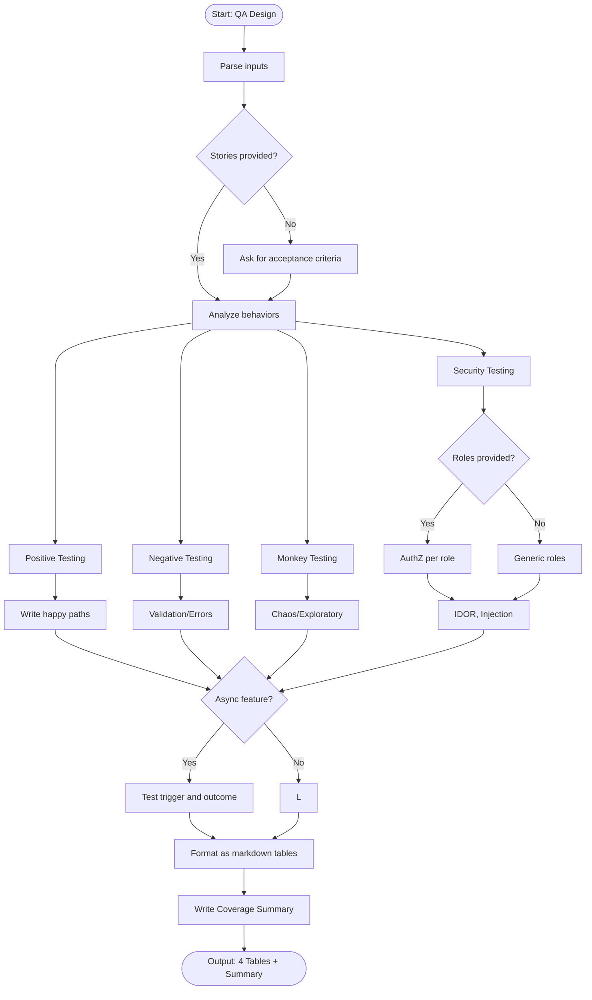

# Skill: QA Design

## Purpose
Design language-agnostic test scenarios (Positive, Negative, Monkey, Security) describing *what* to test based on requirements.

## Input
| Variable | Type | Req | Description |
|----------|------|-----|-------------|
| `feature_description` | string | Yes | Rules and purpose |
| `user_stories` | string | Yes | "As a [role]..." |
| `tech_stack` | string | No | Technology stack |
| `roles` | string | No | User roles |

## Instructions
- **Positive Testing**: Write scenarios for happy paths using valid inputs and permissions.
- **Negative Testing**: Design tests for validation (invalid format, missing fields), boundaries, and unauthorized access.
- **Monkey Testing**: Simulate chaos (rapid actions, concurrent requests, extreme inputs).
- **Security Testing**: Verify AuthZ/AuthN boundaries, IDOR, and input injection (XSS/SQLi).
- **Reporting**: Present as markdown tables (ID | Title | Preconditions | Steps | Expected | Priority).
- **Summary**: End with a Coverage Summary mapping scenarios to user stories.

## Edge Cases
| Case | Strategy |
|------|----------|
| No Stories | Stop and request acceptance criteria first. |
| Async Flows | Specifically test the trigger and eventual outcome state. |
| Auth | Test escalation paths and cross-role access boundaries. |

## Workflow

## Examples
- [Input Example](@examples/input.md)
- [Output Example](@examples/output.md)

## Quality Gate
- [ ] Both positive and negative cases included.
- [ ] Boundary conditions covered.
- [ ] Authorization scenarios included.
- [ ] Traceable to user stories.
- [ ] No test code included.

## Changelog
| Version | Date | Description |
|---------|------|-------------|
| 1.1.0 | 2026-03-20 | Restructured: tables used, metadata updated |
| 1.0.0 | 2026-03-20 | Initial release |
