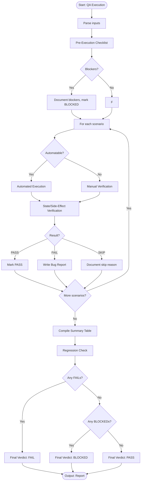

# Skill: QA Execution

## Purpose
Execute language-agnostic test plans against implementations to produce pass/fail verification reports and reproduction evidence.

## Input
| Variable | Type | Req | Description |
|----------|------|-----|-------------|
| `feature_description` | string | Yes | Feature purpose |
| `test_plan` | string | Yes | Scenarios to run |
| `implementation_summary` | string | Yes | Endpoints/components |
| `tech_stack` | string | No | Technology stack |
| `environment` | string | No | Test env details |

## Instructions
- **Checks**: Verify clean/seeded env, running deps, and AC coverage before starting.
- **Automation**: Execute test commands (e.g., `pest`, `jest`, `pytest`); report PASS/FAIL/SKIP with reasons.
- **Manual**: Follow plan steps exactly; verify expected vs. actual UI/logic behavior.
- **Side-Effects**: Confirm DB records (created/updated/deleted) and event emissions.
- **Bug Reporting**: For every FAIL, provide Bug ID, Severity, Actual vs Expected, Steps, and Evidence.
- **Verdict**: Compile summary table and provide final verdict: PASS, FAIL, or BLOCKED.

## Edge Cases
| Case | Strategy |
|------|----------|
| Flaky | Document as flaky; do not confirm bug until consistently reproducible. |
| Environment | Explicitly document environment-specific discrepancies. |
| Blocked | Mark as BLOCKED with clear reason; do not skip silently. |

## Workflow

## Examples
- [Input Example](@examples/input.md)
- [Output Example](@examples/output.md)

## Quality Gate
- [ ] Bug reports reproducible.
- [ ] Severity accurate.
- [ ] Actual vs Expected clear.
- [ ] Environment info captured.
- [ ] Regression risks identified.

## Changelog
| Version | Date | Description |
|---------|------|-------------|
| 1.0.0 | 2026-03-20 | Initial release |
