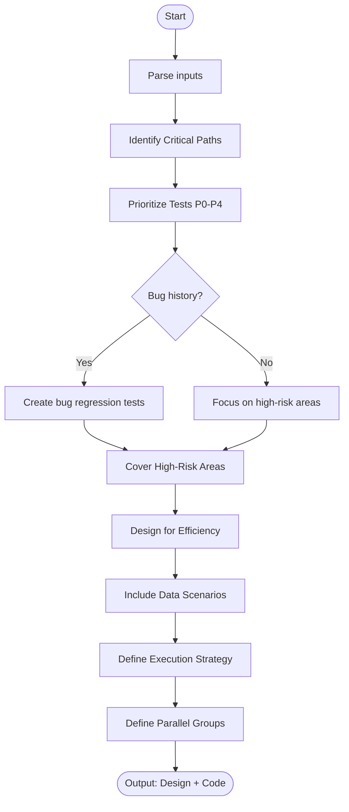

# Skill: Regression Test Suite Design

## Purpose
Design a prioritized test catalog preventing bug recurrence and ensuring critical functional persistence.

## Input
| Variable | Type | Req | Description |
|----------|------|-----|-------------|
| `application_description`| string | Yes | App features and history |
| `tech_stack` | string | Yes | Stack and framework |
| `bug_history` | string | No | List of previously fixed bugs |

## Instructions
- **Critical Paths**: Identify core user journeys, revenue-critical features, auth flows, and integrations.
- **Prioritization**: Assign levels P0 (Smoke), P1 (Critical), P2 (High), P3 (Medium), or P4 (Low).
- **Bug Fixes**: Create unique tests per known bug (named BUG-{ID}) to verify fixes.
- **High-Risk**: Focus on complex logic, data transformations, and concurrent state management.
- **Efficiency**: Group by feature; identify parallel tests to minimize execution time.
- **Data**: Define scenarios for production-like volumes, migration states, and edge cases.

## Edge Cases
| Case | Strategy |
|------|----------|
| Flaky | Analyze for non-determinism; fix or remove from suite. |
| Dependency | Ensure test independence from shared or production data. |
| Performance | Include specific timing assertions for P0/P1 paths. |

## Workflow

## Examples
- [Input Example](@examples/input.md)
- [Output Example](@examples/output.md)

## Quality Gate
- [ ] Critical paths covered in P0/P1.
- [ ] Known bugs have regression tests.
- [ ] Prioritized by risk level.
- [ ] Execution set is efficient (parallelizable).
- [ ] Tests are self-contained.

## Changelog
| Version | Date | Description |
|---------|------|-------------|
| 1.1.0 | 2026-03-20 | Restructured: moved examples/references, added fields |
| 1.0.0 | 2026-03-20 | Initial release |
