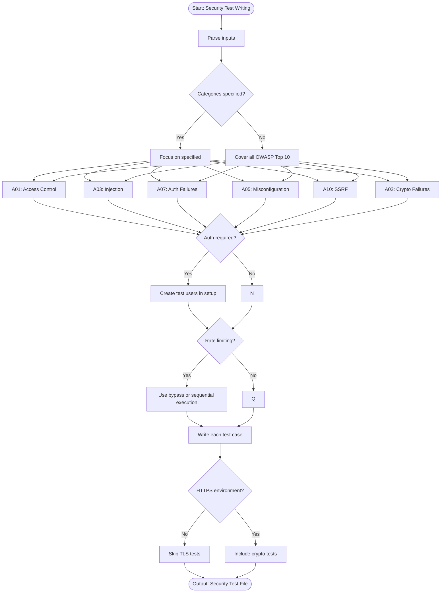

# Skill: Security Penetration Test Case Writing

## Purpose
Generate automated security tests for OWASP Top 10 vulnerabilities to verify controls and fix flaws before deployment.

## Input
| Variable | Type | Req | Description |
|----------|------|-----|-------------|
| `target_description` | string | Yes | App/API description |
| `tech_stack` | string | Yes | e.g., "Node.js + Express" |
| `owasp_categories` | string | No | Default: all Top 10 |

## Instructions
- **Access Control**: Test horizontal/vertical privilege escalation and IDOR.
- **Injection**: Test SQL, NoSQL, Command, LDAP, and XPath injection in all inputs.
- **Auth**: Verify password policies, account lockout, JWT flaws, and session fixation.
- **Data/Crypto**: Check for sensitive data leakage in logs, weak algorithms, and SSRF.
- **Misconfig**: Scan for verbose errors, default credentials, and missing headers.
- **Components**: Audit dependencies (npm/pip) for known CVEs; report findings.

## Edge Cases
| Case | Strategy |
|------|----------|
| Auth | Create test users in setup to probe protected endpoint boundaries. |
| Rate Limiting | Use bypasses or sequential execution to avoid blocking tests. |
| HTTPS | Skip TLS/header tests if target environment is not production-like. |

## Workflow

## Examples
- [Input Example](@examples/input.md)
- [Output Example](@examples/output.md)

## Quality Gate
- [ ] All requested OWASP categories covered.
- [ ] Injection payloads are realistic.
- [ ] Privilege escalation scenarios included.
- [ ] Auth bypass tested.
- [ ] Secure behavior (not just no-error) verified.

## Changelog
| Version | Date | Description |
|---------|------|-------------|
| 1.1.0 | 2026-03-20 | Restructured: moved examples, references, added compatibility/license |
| 1.0.0 | 2026-03-20 | Initial release |
