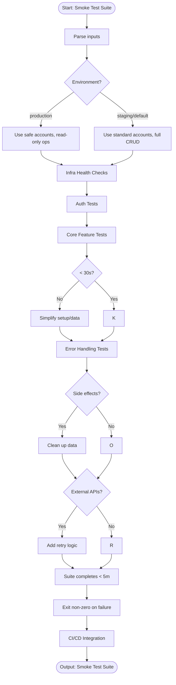

# Skill: Smoke Test Suite

## Purpose
Generate a fast (<5 min), focused suite to verify critical post-deployment functionality.

## Input
| Variable | Type | Req | Description |
|----------|------|-----|-------------|
| `application_description`| string | Yes | Features and critical paths |
| `tech_stack` | string | Yes | e.g., "Node.js + Express" |
| `environment` | string | No | staging/production |

## Instructions
- **Focus**: Test health checks, authentication, core CRUD, and key integrations only.
- **Speed**: Ensure each test completes in <30s; avoid large datasets or complex setup.
- **Infrastructure**: Verify connectivity to DB, Cache, External APIs, and File Systems.
- **Signal**: Return a clear exit code and actionable error messages for failure.
- **Env-Aware**: Use environment-specific URLs and test accounts; skip inapplicable tests.
- **Trigger**: Integrate with CI/CD to trigger automated rollbacks on failure.

## Edge Cases
| Case | Strategy |
|------|----------|
| Cleanup | Use dedicated test accounts; clean up generated data post-run. |
| Flaky | Add limited retry logic specifically for external dependency checks. |
| Diff | Use conditional execution for environment-specific features. |

## Workflow

## Examples
- [Input Example](@examples/input.md)
- [Output Example](@examples/output.md)

## Quality Gate
- [ ] Completes in <5 minutes.
- [ ] Critical paths covered.
- [ ] Exits non-zero on failure.
- [ ] CI/CD integration included.
- [ ] Environment-aware.

## Changelog
| Version | Date | Description |
|---------|------|-------------|
| 1.1.0 | 2026-03-20 | Restructured: moved examples, references, added compatibility/license |
| 1.0.0 | 2026-03-20 | Initial release |
