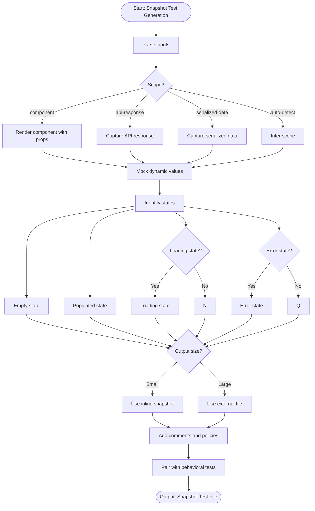

# Skill: Snapshot Test Generation

## Purpose
Generate snapshot tests to capture rendered UI or API outputs and detect unintended visual/contract changes.

## Input
| Variable | Type | Req | Description |
|----------|------|-----|-------------|
| `component_or_endpoint` | string | Yes | Code or URL to snapshot |
| `tech_stack` | string | Yes | e.g., "React + Jest" |
| `snapshot_scope` | string | No | component, api, or data |

## Instructions
- **Meaningful**: Render with realistic props/data; capture loading, error, empty, and populated states.
- **Dynamic Values**: Mock timestamps, UUIDs, and random IDs to fixed, deterministic values.
- **Maintenance**: Use inline snapshots for small outputs; external files for large ones.
- **Pairing**: Use snapshots for appearance/contract; pair with unit tests for behavioral logic.
- **Policy**: Document snapshot update policies to prevent "lazy updating" of regressions.

## Edge Cases
| Case | Strategy |
|------|----------|
| Dynamic | Always mock random/time-based values to ensure deterministic tests. |
| Large | Use targeted property assertions instead of full-file snapshots. |
| Drift | Document the specific scenarios requiring a manual snapshot update. |

## Workflow

## Examples
- [Input Example](@examples/input.md)
- [Output Example](@examples/output.md)

## Quality Gate
- [ ] Dynamic values mocked.
- [ ] Multiple states captured.
- [ ] Inline snapshots used for small snippets.
- [ ] Paired with behavioral tests.
- [ ] Update policy defined.

## Changelog
| Version | Date | Description |
|---------|------|-------------|
| 1.1.0 | 2026-03-20 | Restructured: moved examples, references, added compatibility/license |
| 1.0.0 | 2026-03-20 | Initial release |
