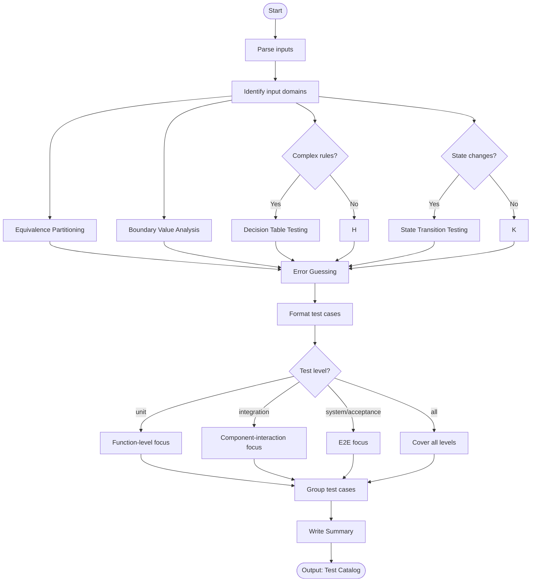

# Skill: Test Case Design

## Purpose
Generate structured test case catalogs from requirements using standard analysis techniques (Equivalence Partitioning, BVA).

## Input
| Variable | Type | Req | Description |
|----------|------|-----|-------------|
| `requirements` | string | Yes | Requirements/User Story |
| `tech_stack` | string | Yes | Target technology stack |
| `test_level` | string | No | unit, integration, or e2e |

## Instructions
- **Equivalence**: Partition inputs into valid/invalid classes; design tests for each class.
- **Boundaries**: Test numeric/length boundaries (Min, Min+1, Max, Max+1, Max-1).
- **Decisions**: Create tables for complex rules; cover all condition combinations.
- **State**: Document valid transitions; test each valid flow and one invalid per state.
- **Error Guessing**: Identify likely traps (nulls, empty strings, concurrency).
- **Structure**: Format as Catalog: ID | Name | Objective | Preconditions | Steps | Expected | Priority.

## Edge Cases
| Case | Strategy |
|------|----------|
| Vague | Flag ambiguities and ask for clarification before finalizing. |
| Non-functional | Include specific performance or security boundary cases. |
| Complex State | Use Mermaid state transition diagrams for visualization. |

## Workflow

## Examples
- [Input Example](@examples/input.md)
- [Output Example](@examples/output.md)

## Quality Gate
- [ ] Equivalence classes identified.
- [ ] Boundaries tested (min/max/invalid).
- [ ] Positive/Negative scenarios balanced.
- [ ] Priorities assigned by risk.
- [ ] No implementation code included.

## Changelog
| Version | Date | Description |
|---------|------|-------------|
| 1.1.0 | 2026-03-20 | Restructured: moved examples/references, added fields |
| 1.0.0 | 2026-03-20 | Initial release |
