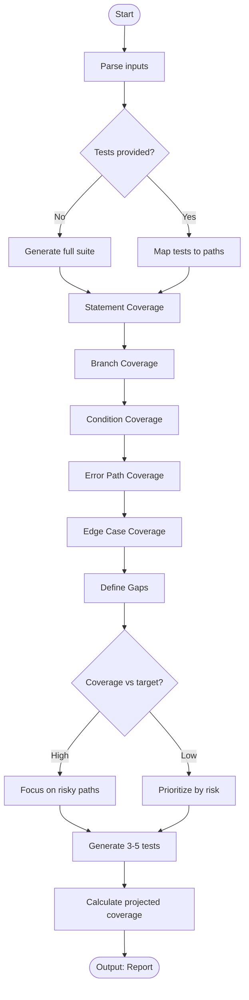

# Skill: Test Coverage Analysis

## Purpose
Identify test coverage gaps (paths, branches, conditions) and generate tests to achieve comprehensive logic verification.

## Input
| Variable | Type | Req | Description |
|----------|------|-----|-------------|
| `code_context` | string | Yes | Source code |
| `existing_tests` | string | Yes | Current test suite |
| `tech_stack` | string | Yes | Stack and framework |
| `coverage_target` | string | No | Default: 80% |

## Instructions
- **Analysis**: Check Statement, Branch (True/False), and Condition (Boolean logic) coverage.
- **Error Paths**: Identify untested error handling and exception blocks.
- **Edge Cases**: List missing boundary value and null check tests.
- **Gap Mapping**: Provide Type, Location, Description, Risk Level, and Suggested Test per gap.
- **Remediation**: Generate 3-5 new test cases providing maximum coverage improvement.
- **Prioritization**: Rank gaps by logic risk (e.g., security, state change).

## Edge Cases
| Case | Strategy |
|------|----------|
| No Tests | Perform full analysis and generate a complete foundational suite. |
| High Coverage | Focus exclusively on risky exception paths and edge conditions. |
| Complex Logic | Use path coverage analysis for deeply nested or recursive logic. |

## Workflow

## Examples
- [Input Example](@examples/input.md)
- [Output Example](@examples/output.md)

## Quality Gate
- [ ] All branches analyzed.
- [ ] Error paths identified.
- [ ] Boundary values tested.
- [ ] Generated code is executable.
- [ ] Risk-based prioritization applied.

## Changelog
| Version | Date | Description |
|---------|------|-------------|
| 1.1.0 | 2026-03-20 | Restructured: moved examples/references, added fields |
| 1.0.0 | 2026-03-20 | Initial release |
