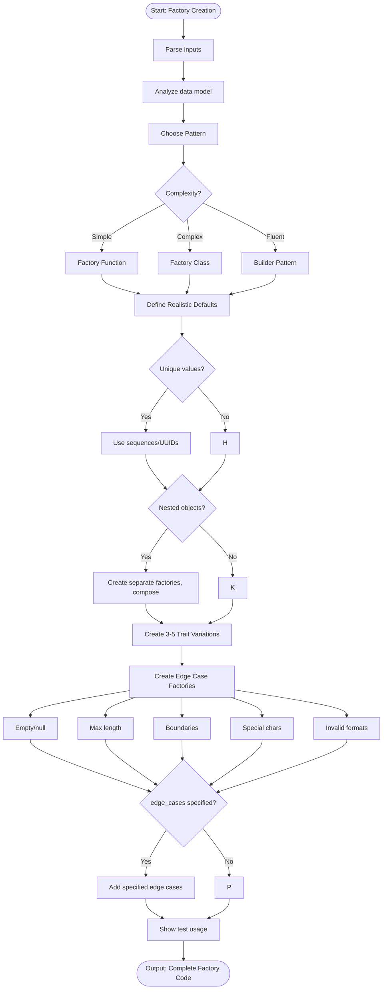

# Skill: Test Data Factory Creation

## Purpose
Generate test data factories (Functions, Classes, Builders) to produce valid, varied, and edge-case data for tests.

## Input
| Variable | Type | Req | Description |
|----------|------|-----|-------------|
| `data_model` | string | Yes | Interface or schema |
| `tech_stack` | string | Yes | Stack and library |
| `edge_cases` | string | No | Specific cases to include |

## Instructions
- **Realistic Defaults**: Use meaningful values (not "test"); generate unique emails/IDs.
- **Customization**: Allow field overrides and support partial updates.
- **Edge Cases**: Include empty/null, min/max length, boundary numbers, and invalid formats.
- **Patterns**: Implement using Factory Functions, Classes, or Builder patterns with Traits.
- **Sequences**: Use auto-increment or UUIDs to avoid unique constraint collisions.
- **Relationships**: Compose factories for nested objects or database relationships.

## Edge Cases
| Case | Strategy |
|------|----------|
| Nested | Create separate sub-factories and compose them in the parent. |
| Constraints | Use sequences or randomized unique strings for unique fields. |
| Large data | Optimize for performance if generating bulk datasets for load tests. |

## Workflow

## Examples
- [Input Example](@examples/input.md)
- [Output Example](@examples/output.md)

## Quality Gate
- [ ] Defaults are realistic.
- [ ] Uniqueness enforced via sequences.
- [ ] Traits included for common variants.
- [ ] Edge cases comprehensively covered.
- [ ] Usage example provided.

## Changelog
| Version | Date | Description |
|---------|------|-------------|
| 1.1.0 | 2026-03-20 | Restructured: moved examples, references, added compatibility/license |
| 1.0.0 | 2026-03-20 | Initial release |
