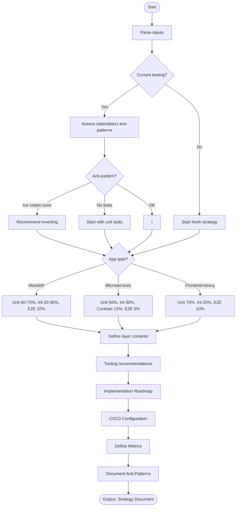

# Skill: Test Pyramid Strategy

## Purpose
Designs a test pyramid strategy tailored to an application, recommending unit/integration/E2E ratios, tooling, and implementation guidance.

## Input
| Variable | Type | Required | Description |
|----------|------|----------|-------------|
| `{{application_description}}` | string | yes | App type, architecture, team size |
| `{{tech_stack}}` | string | yes | Technology stack |
| `{{current_testing}}` | string | no | Current approach and pain points |

## Prompt

Act as a senior test architect.

Application:
```
{{application_description}}
```
Stack: {{tech_stack}}
Current testing: {{current_testing}}

Design a test pyramid strategy:

**1. Define Layers**
- **Unit (base)**: Fast, isolated
- **Integration (middle)**: Component interactions, API, DB
- **E2E (top)**: Complete user journeys

**2. Recommend Ratios**
- Provide specific ratios based on architecture/risk.
- Adjust for microservices/monolith/frontend-heavy.

**3. Define Layer Contents**
- Unit: Business logic, utilities, transformations
- Integration: API endpoints, DB queries, service interactions
- E2E: Critical user journeys

**4. Tooling Recommendations**
- Recommend specific tools per layer with justification.
- Include CI/CD guidance.

**5. Implementation Roadmap**
- New app: Where to begin
- Existing app: What to add/remove
- Prioritize by risk/value

**6. Anti-Patterns**
- Ice cream cone
- Testing implementation details
- Over-mocking in integration
- Slow unit tests

**7. Metrics and Goals**
- Target coverage per layer
- Execution time targets
- Flakiness rate targets

Output complete strategy document.

## Examples

@examples/input.md
@examples/output.md

## Edge Cases
- **Legacy apps**: Start with integration tests for critical paths.
- **Frontend-heavy apps**: Increase unit test ratio for components.
- **Data pipelines**: Replace E2E with data quality tests.

## Output Format
Document containing current state assessment, recommended pyramid (ratios/contents), tooling, roadmap, CI/CD config, and success metrics. 800-1200 words.

## Senior Review Checklist
- [ ] Ratios justified?
- [ ] Roadmap realistic/prioritized?
- [ ] Anti-patterns called out?
- [ ] CI/CD addressed?
- [ ] Metrics defined?

## Changelog
| Version | Date | Description |
|---------|------|-------------|
| 1.1.0 | 2026-03-20 | Restructured: moved examples/references, added fields |
| 1.0.0 | 2026-03-20 | Initial release |

## Output Path

```
.agents/documents/application/testing/{module-slug}/
```

## Mermaid Diagram

