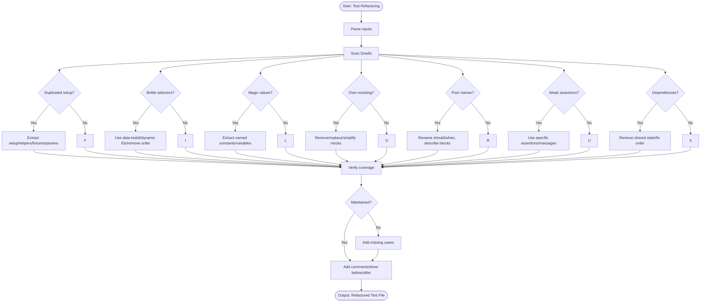

# Skill: Test Refactoring

## Purpose
Refactor tests to improve maintainability, reduce duplication, and increase reliability. Identify smells (brittle selectors, magic numbers, duplicated setup, over-mocking) and apply refactoring patterns. Maintain original coverage.

## Input
| Variable | Type | Required | Description |
|----------|------|----------|-------------|
| `{{test_code}}` | string | yes | Test code to refactor |
| `{{tech_stack}}` | string | yes | Tech stack and test framework |
| `{{refactoring_goals}}` | string | no | "reduce duplication", "improve readability", "fix brittleness", "improve speed" |

## Prompt

You are a senior test engineer refactoring tests.

Test code:
```
{{test_code}}
```

Tech stack: {{tech_stack}}
Goals: {{refactoring_goals}}

Fix test smells:

**1. Test Duplication (DRY)**
- Extract setup to beforeEach/setUp
- Create helper functions for assertions
- Use parameterized tests
- Extract shared fixtures

**2. Brittle Tests**
- Replace hardcoded IDs with dynamic values
- Replace CSS classes with data-testid
- Replace exact strings with partial matches
- Remove order dependency

**3. Magic Numbers/Strings**
- Extract to named constants
- Use descriptive variable names

**4. Over-Mocking**
- Remove unnecessary mocks
- Replace mocks with real implementations
- Simplify mock setup

**5. Poor Test Names**
- Rename to "should [behavior] when [condition]"
- Describe behavior, not implementation
- Group in describe blocks

**6. Slow Tests**
- Parallelize tests
- Replace slow I/O
- Reduce setup/teardown

**7. Assertion Quality**
- Replace weak assertions (toBeTruthy) with specific ones (toBe, toEqual)
- Add meaningful error messages
- Assert proper detail level

**8. Test Independence**
- Remove shared mutable state
- Ensure independent execution
- Fix order dependency

For each refactoring:
- Show before/after code
- Explain smell fixed
- Explain improvement

Output complete refactored file.

## Examples

@examples/input.md
@examples/output.md

## Edge Cases
- **Implementation testing**: Refactor to test behavior.
- **Complex setup**: Check if code needs refactoring.
- **Large tests**: Split into focused tests.

## Output Format
Refactored file with:
- Inline comments explaining refactorings
- Before/after for major changes
- Smell summary
- Same coverage
- 200-500 lines

## Senior Review Checklist
- [ ] Coverage maintained?
- [ ] Smells addressed?
- [ ] Readable and understandable?
- [ ] Independent execution?
- [ ] Parameterized tests used?

## Changelog
| Version | Date | Description |
|---------|------|-------------|
| 1.1.0 | 2026-03-20 | Restructured: moved examples, references, added compatibility/license |
| 1.0.0 | 2026-03-20 | Initial release |

## Output Path

```
.agents/documents/application/testing/{module-slug}/
```

## Mermaid Diagram

