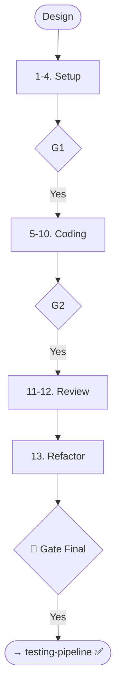

# Skill: Coding Pipeline

## Purpose
Implements features from specs and design artifacts through setup, coding, and review.

## Operations

### 🔴 GATE 0 (ask_user)
- **Question**: "Start Coding Pipeline (Setup, Implementation, Errors, Logging, Review, Refactor)?"

### Step Mapping

| Step | Skill | Output |
|------|-------|--------|
| 1 | `tech-stack-guidelines` | Loaded Standards |
| 2-3 | `boilerplate` + `env-setup` | Project Scaffold |
| 4 | `configuration-management` | Config System |
| 5 | `api-implementation` | API Layer |
| 6-7 | `code-gen` + `interface` | Feature Logic |
| 8-9 | `error-patterns` + `logging` | Ops Infrastructure |
| 10 | `inline-comment-generation` | Documented Code |
| 11-12| `code-review` + `senior-review`| Review Findings |
| 13 | `refactoring` | Refined Code |

## 🔴 GATES
- **Gate 1**: Approve Scaffold & Config.
- **Gate 2**: Approve Implementation (pre-review).
- **Gate Final**: Code ready for Testing.

## Optional Implementation
Background jobs, Caching, Webhooks, SDKs, Pagination, Rate-limiting, Docker, CI/CD, IaC.

## Mermaid Diagram

