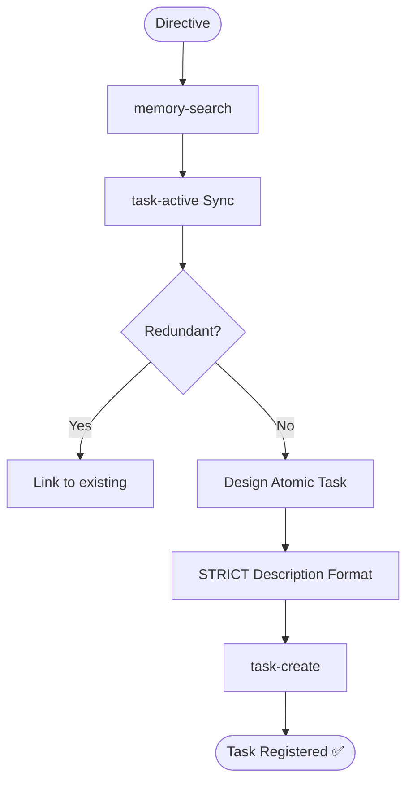

# Skill: Task Creation Orchestrator

## Purpose
Analyzes directives and designs structured, atomic tasks in Local Memory MCP.

## 🚫 ABSOLUTE CONSTRAINTS
- **NO EXECUTION**: Forbidden from editing/creating files, running commands, or implementing code.
- **ALLOWED OUTPUT**: ONLY `task-create`, `memory-store`, `task-active`, `task-list`, `task-detail`, `memory-search`.
- **NO NARRATIVE**: Do not output explanations or text outside tool calls.

## Pre-Analysis (MANDATORY)
1. `memory-search`: Check historical/arch context.
2. `task-active`: Sync backlog; prevent redundancy.

## Task Design Principles
- **Atomic**: One logical change per task.
- **Context-Rich**: Include paths, symbols, and API shapes.
- **Test-Ready**: Include Positive/Negative test cases.

## Description Format (STRICT)
1. **Context & Analysis**: Finding/Trigger, Observation, and Goal.
2. **Target Files & Implementation**: Files + exact technical changes (grouped by layer).
3. **Acceptance & Verification**: Checklist + Testing scenarios.

## Mermaid Diagram

