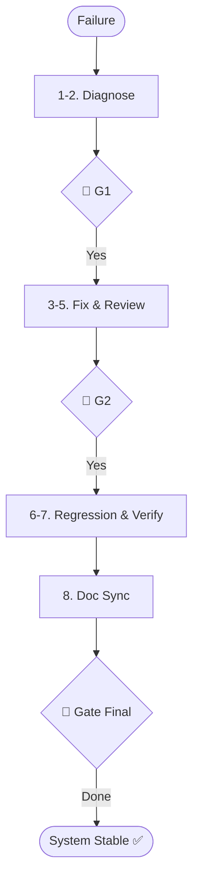

# Skill: Debugging Pipeline

## Purpose
Diagnoses and resolves failures, regressions, and performance bottlenecks.

## Operations

### 🔴 GATE 0 (ask_user)
- **Question**: "Start Debugging Pipeline (Analysis, Root Cause, Fix, Regression Test)?"

### Classification & Step Mapping

| Type | Symptom | Action |
|------|---------|--------|
| Runtime | Stack trace | `error-analysis` + `root-cause-id` |
| Silent | Anomalous behavior| `log-interpretation` |
| Build | CI/CD Fail | `build-failure-analysis` |
| Perf | Slow/High Usage | `performance-bottleneck-analysis` |
| Arch | Layer Violation | `deep-audit` |

## Fix & Verification
1. **Suggest Fix**: `fix-suggestion` (Before/After).
2. **Review**: `code-review`.
3. **Apply**: `refactoring`.
4. **Regression**: `unit-test-generation` (Reproduce first).
5. **Verify**: Full suite run.
6. **Sync**: `update-documentation` (if behavior changed).

## 🔴 GATES
- **Gate 1**: Confirm Root Cause.
- **Gate 2**: Confirm Fix implementation.
- **Gate Final**: Fixed + Verified + Documented.

## Mermaid Diagram

