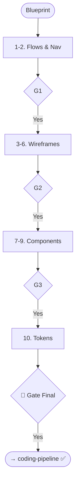

# Skill: Design Pipeline

## Purpose
Transforms technical specs into design artifacts (Flows, Wireframes, Inventory, Tokens).

## Operations

### 🔴 GATE 0 (ask_user)
- **Question**: "Start Design Pipeline (User Flows, Nav, Wireframes, Inventory, Tokens)?"

### Step Mapping

| Step | Skill | Output |
|------|-------|--------|
| 1 | `user-flow-diagram-description` | Flow Descriptions |
| 2 | `navigation-structure-design` | Site Map & Routes |
| 3 | `screen-wireframe-generation` | ASCII/Visual Wireframes |
| 4 | `responsive-layout-planning` | Reflow Specs |
| 5 | `mobile-first-ui-specification` | Mobile UI Spec |
| 6 | `dashboard-layout-design` | Data Grid Spec |
| 7 | `component-inventory-generation` | Props & States List |
| 8 | `form-design-specification` | Field & Validation Spec |
| 9 | `modal-overlay-design` | Overlay Specs |
| 10 | `design-system-specification` | Tokens (CSS/Tailwind) |

## 🔴 GATES
- **Gate 1**: Approve Flows & Navigation.
- **Gate 2**: Approve Wireframes & Layouts.
- **Gate 3**: Approve Components & Forms.
- **Gate Final**: Design complete; ready for Coding.

## Mermaid Diagram

