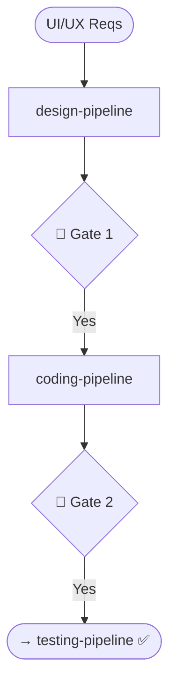

# Skill: Design to Code Orchestrator

## Purpose
Chains `design-pipeline` and `coding-pipeline` to implement UI requirements.

## Pipeline Sequence

| Phase | Pipeline | Artifacts |
|-------|----------|-----------|
| 1 | `design-pipeline` | Flows, Wireframes, Inventory, Tokens |
| 2 | `coding-pipeline` | Components, Logic, Review, Refactor |

## 🔴 GATES
- **Gate 1**: Present design artifacts. Ask: "Design approved. Proceed to coding?"
- **Gate 2**: Present implemented modules. Ask: "Implementation complete. Proceed to testing?"

## Context Rule
Pass accumulated context (input + `@paths`) to each pipeline.

## Mermaid Diagram

