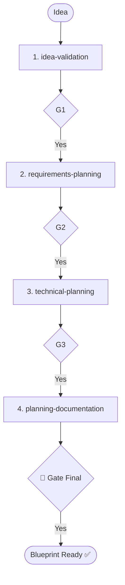

# Skill: Idea to Blueprint Orchestrator

## Purpose
Transforms raw product ideas into implementation-ready blueprints.

## Pipeline Sequence

| Phase | Pipeline | Core Output |
|-------|----------|-------------|
| 1 | `idea-validation` | Feasibility & Scoped Features |
| 2 | `requirements-planning` | User Stories & AC |
| 3 | `technical-planning` | Arch, DB, API, Sprints |
| 4 | `planning-documentation` | BRD, PRD, FSD, TDD, Module Docs |

## 🔴 GATES
Wait for explicit confirmation between phases.
- **Gate 1**: Idea validated?
- **Gate 2**: Requirements approved?
- **Gate 3**: Technical blueprint approved?
- **Gate 4**: Blueprint complete (Docs + Handoff ready)?

## Mandatory Mandates
- **Reference Examples**: Use `@.agents/documents/_examples/` for all documentation structure.
- **Module Coverage**: Phase 4 is incomplete without ALL 4 module documents (Overview, Feature, API, Test).

## Mermaid Diagram

