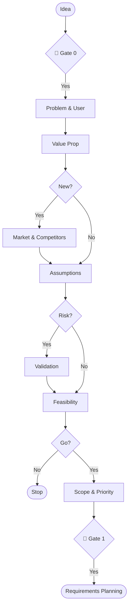

# Skill: Idea Validation Pipeline

## Purpose
Pipeline for validating raw product ideas before resource commitment.

## Operations

### 🔴 GATE 0 (ask_user)
Must confirm intent before Step 1.
- **Question**: "Start Idea Validation Pipeline (Problem, User, Value Prop, Market, Competitors, Assumptions, Feasibility, Scope)?"
- **Options**: `Proceed`, `Stop`.

### Checklist (MANDATORY)
1. [ ] Identify Problem
2. [ ] Define Target User
3. [ ] Write Value Prop
4. [ ] Analyze Market (new only)
5. [ ] Map Competitors (new only)
6. [ ] Map Assumptions
7. [ ] Validate Assumptions
8. [ ] Assess Feasibility
9. [ ] Define Scope
10. [ ] Prioritize Features

## Step Mapping

| Step | Skill | Output |
|------|-------|--------|
| 1 | `problem-identification` | Problem Statement |
| 2 | `target-user-definition` | User Persona |
| 3 | `value-proposition-writing` | Value Prop Statement |
| 4 | `market-sizing` | Market Size Doc |
| 5 | `competitor-analysis` | Competitor Table |
| 6 | `assumption-mapping` | Assumption Map |
| 7 | `hypothesis-validation` | Experiment Design |
| 8 | `feasibility-assessment` | Feasibility Report |
| 9 | `mvp-scope-definition` | Scoped Feature List |
| 10 | `feature-prioritization` | Prioritized Backlog |

## 🔴 GATE 1 (ask_user)
After Step 10: Present summary and ask to proceed to `requirements-planning`.

## Output Path
Refer to individual skills for artifact paths.

## Mermaid Diagram

