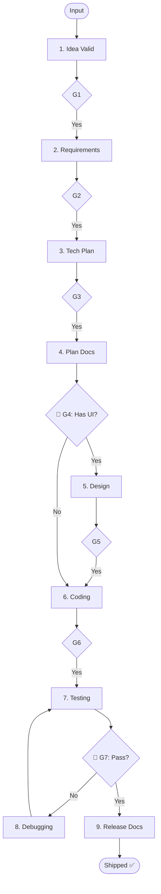

# Skill: Implement Feature Orchestrator

## Purpose
End-to-end orchestrator chaining all pipelines from idea to shippable feature.

## Pipeline Sequence

| Phase | Pipeline | Condition |
|-------|----------|-----------|
| 1 | `idea-validation` | New product/feature |
| 2 | `requirements-planning` | Validated concept |
| 3 | `technical-planning` | Requirements done |
| 4 | `planning-documentation`| Blueprint done |
| 5 | `design-pipeline` | If has UI/Frontend |
| 6 | `coding-pipeline` | Docs/Design ready |
| 7 | `testing-pipeline` | Code implemented |
| 8 | `debugging-pipeline` | If tests fail |
| 9 | `release-documentation`| All tests passing |

## 🔴 TOP-LEVEL GATES (MANDATORY)
Wait for explicit confirmation between phases. **NO AUTO-PROCEED.**

## Prohibited Behaviors
- Skipping Phase 5 (Design) for UI apps.
- Answering own gate questions.
- Proceeding without explicit confirmation.

## Mermaid Diagram

