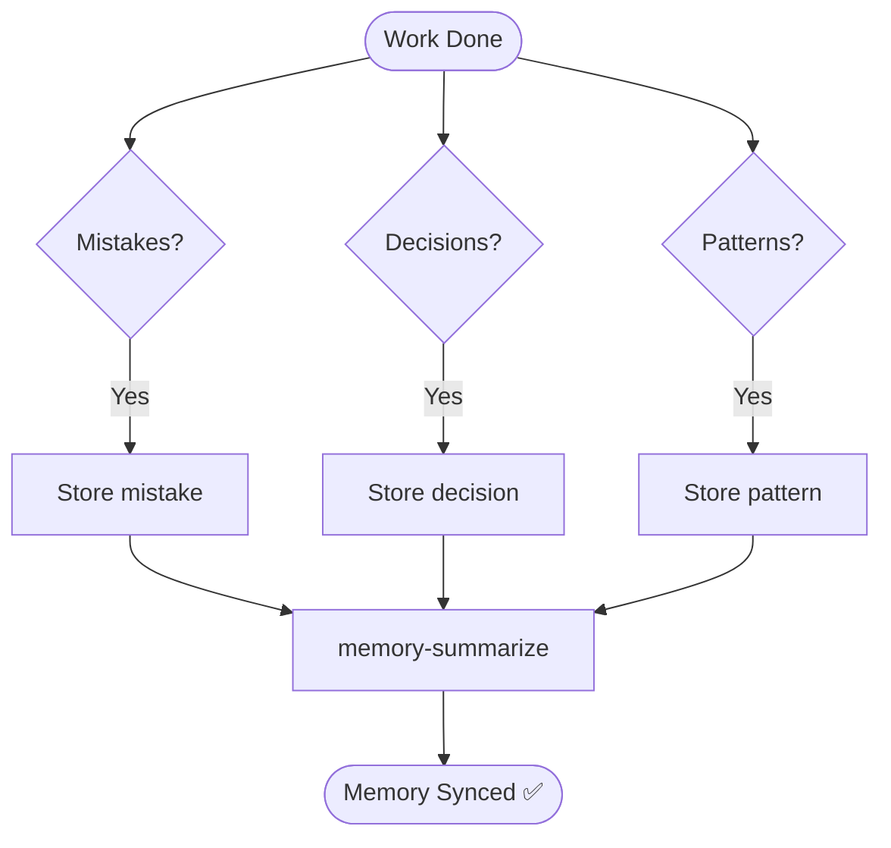

# Skill: Learning Retrospective

## Purpose
Extracts and stores durable knowledge in the repository's long-term memory.

## Knowledge Types

| Type | Description | Store As |
|------|-------------|----------|
| **Mistakes** | Bugs, environment quirks, "gotchas". | `mistake` |
| **Decisions** | Trade-offs, library/pattern choices. | `decision` |
| **Patterns** | Repeatable standards, code style. | `pattern` |

## Actions
- `memory-search`: Check existing context.
- `memory-store`: Record findings (Title, Content, Type, Importance, Tags).
- `memory-summarize`: Update repository summary.

## memory-store Rules
- **Title**: Concise (e.g., "Use UUID for IDs").
- **Content**: Objective rule/fact; no narrative.
- **Importance**: 1–5.
- **Tags**: Tech stack tags (e.g., `['typescript']`).

## Mermaid Diagram

