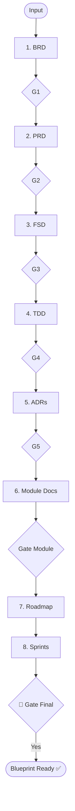

# Skill: Planning Documentation Pipeline

## Purpose
Produces the complete technical and product blueprint before coding begins.

## Operations

### 🔴 GATE 0 (ask_user)
Must confirm before Step 1.
- **Question**: "Start Planning Documentation Pipeline (BRD, PRD, FSD, TDD, ADRs, Module Docs, Roadmap, Sprints)?"

### Step Mapping

| Step | Output | Path |
|------|--------|------|
| 1 | BRD | `.agents/documents/requirements/brd/` |
| 2 | PRD | `.agents/documents/requirements/prd/` |
| 3 | FSD | `.agents/documents/requirements/fsd/` |
| 4 | TDD | `.agents/documents/requirements/tdd/` |
| 5 | ADRs | `.agents/documents/decisions/` |
| 6 | Module Docs | `.agents/documents/application/modules/` |
| 7 | Roadmap | `.agents/documents/tasks/roadmap/` |
| 8 | Sprints | `.agents/documents/tasks/sprints/` |

## 🔴 INTERNAL GATES
- **Gate 1-4**: Confirm each major doc (BRD, PRD, FSD, TDD).
- **Gate Module**: Validate API covers stories and has test scenarios.
- **Gate Final**: Final blueprint review before handoff to Design/Coding.

## Module Documentation (MANDATORY)
Each module requires:
1. `overview.md`: Responsibility & Architecture.
2. `{feature}.md`: Stories, Flow, Rules, Data Model.
3. `api-{feature}.md`: Endpoints & Validation.
4. `test-{feature}.md`: Scenarios (Pos/Neg/Edge/Security).

## Mermaid Diagram

