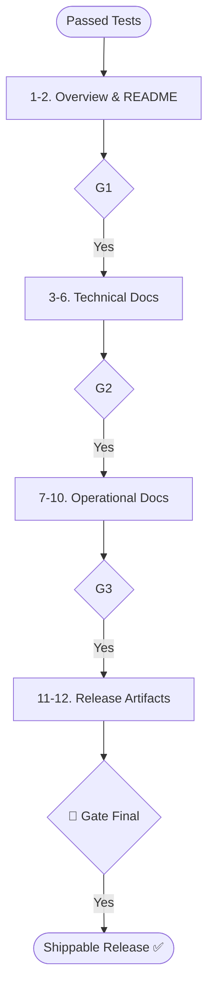

# Skill: Release Documentation Pipeline

## Purpose
Produces shippable post-implementation documentation and release artifacts.

## Operations

### 🔴 GATE 0 (ask_user)
- **Question**: "Start Release Documentation Pipeline (README, API, Module, Setup, Runbook, Changelog)?"

### Step Mapping

| Step | Skill | Output |
|------|-------|--------|
| 1 | `project-overview-documentation` | Non-technical Overview |
| 2 | `readme-generation` | Root `README.md` |
| 3 | `api-documentation` | API Reference Docs |
| 4 | `module-documentation` | Technical Module Docs |
| 5 | `database-documentation` | DB Schema Docs |
| 6 | `architecture-documentation` | As-built Architecture |
| 7 | `setup-guide-creation` | Setup Guide |
| 8 | `onboarding-guide-creation` | Onboarding Doc |
| 9-10 | `runbook/troubleshooting` | Operational Runbooks |
| 11 | `changelog-generation` | Root `CHANGELOG.md` |
| 12 | `release-notes-generation` | Version Release Notes |

## 🔴 GATES
- **Gate 1**: Approve Overview & README.
- **Gate 2**: Approve Technical Docs (API/Module/Arch).
- **Gate 3**: Approve Operational Docs (Runbook/Setup).
- **Gate Final**: Ready to ship.

## Mermaid Diagram

