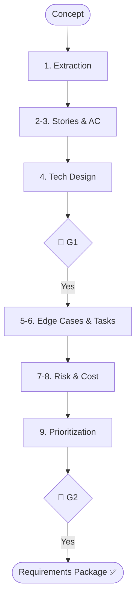

# Skill: Requirements Planning Pipeline

## Purpose
Transforms validated ideas into structured requirements packages.

## Operations

### 🔴 GATE 0 (ask_user)
- **Question**: "Start Requirements Planning Pipeline (Stakeholder Reqs, Stories, AC, Backlog)?"

### Step Mapping

| Step | Skill | Output |
|------|-------|--------|
| 1 | `stakeholder-requirement-extraction` | Requirements List |
| 2 | `user-story-generation` | User Story Set |
| 3 | `acceptance-criteria-writing` | EARS Criteria |
| 4 | `brainstorm-feature` | Technical Design Notes |
| 5 | `edge-case-identification` | Edge Case List |
| 6 | `feature-decomposition` | Task Backlog |
| 7 | `risk-assessment` | Risk Register |
| 8 | `cost-estimation` | Cost Estimate |
| 9 | `feature-prioritization` | Ranked Backlog |

## 🔴 GATES
- **Gate 1**: Approve Requirements & Technical Design Highlights.
- **Gate 2**: Approve Final Backlog & Risk Register.

## Artifact Paths
- **Stories**: `.agents/documents/requirements/user-stories/`
- **Criteria**: `.agents/documents/requirements/acceptance-criteria/`
- **Backlog**: `.agents/documents/tasks/backlog/`

## Mermaid Diagram

