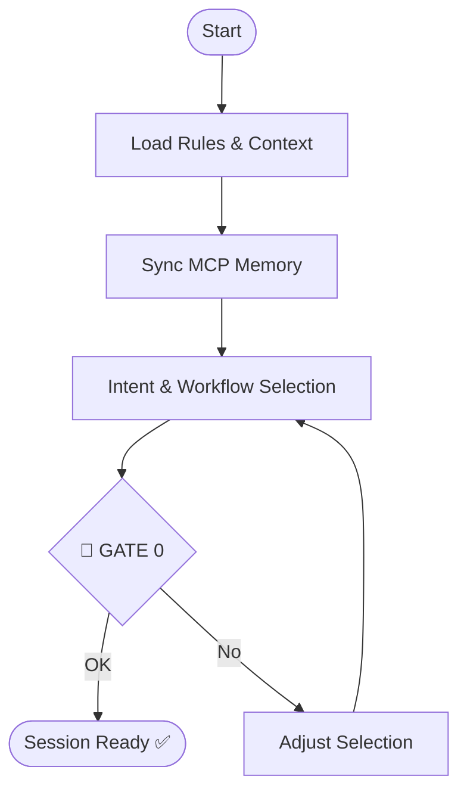

# Skill: Session Start Orchestrator

## Core Directives (MANDATORY)
1. **Auto-Load Rules**: Load `@.agents/rules/` immediately.
2. **Sync Context**: Load `@AGENTS.md` and `@.agents/memory.md`.
3. **MCP Sync**: Connect with `@vheins/local-memory-mcp`.
4. **Verify State**: Identify stack, tasks, and constraints.
5. **Think**: Intent → Workflow → Inputs → Assumptions.

## Workflow Selection

| Intent | Workflow |
| :--- | :--- |
| New App/Feature | `implement-feature` |
| Idea Validation | `idea-to-blueprint` |
| Design Handoff | `design-to-code` |
| Audit/Sync | `audit` or `update-documentation` |
| Bugs/Fixes | `debugging-pipeline` |

## 🔴 GATE 0 (ask_user)
Confirm selection before any work: "Selected [workflow] for [reasoning]. Proceed?"

## Prohibited Behaviors
- Working before rules/context are loaded.
- Executing before GATE 0 confirmation.
- Skipping Sequential Thinking.

## Mermaid Diagram

