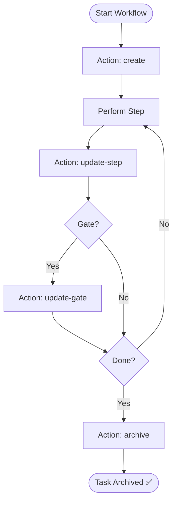

# Skill: Task Management Utility

## Purpose
Manages the lifecycle of workflow task files (`create` → `update` → `archive`).

## Activation Triggers

| Trigger | Action |
|---------|--------|
| Start workflow | `create` task file from template |
| Complete step | `update-step`: Mark `[x]`, add output path |
| Pass gate | `update-gate`: Log decision & notes |
| Interruption | Load existing task file to resume |
| Completion | `archive` task file |

## Input Schema

| Variable | Description |
|----------|-------------|
| `action` | `create`, `update-step`, `update-gate`, `archive` |
| `workflow_slug` | e.g., `coding-pipeline` |
| `project_slug` | e.g., `vibe-api` |
| `step_data` | Number, Name, Output Path |
| `gate_data` | Number, Decision, Notes |

## File Locations
- **Active**: `.agents/documents/_tasks/{workflow-slug}.md`
- **Archive**: `.agents/documents/_tasks/archive/{slug}-{YYYY-MM-DD}.md`

## Task File Structure (MANDATORY)
1. **Metadata**: Workflow, Project, Date, Status.
2. **Checklist**: Copied from workflow steps.
3. **Outputs Table**: Step, Document, Path, Status.
4. **Decisions Log**: Gate, Decision, Notes.
5. **Context Snapshot**: Mandatory updates after each gate.

## Mermaid Diagram

