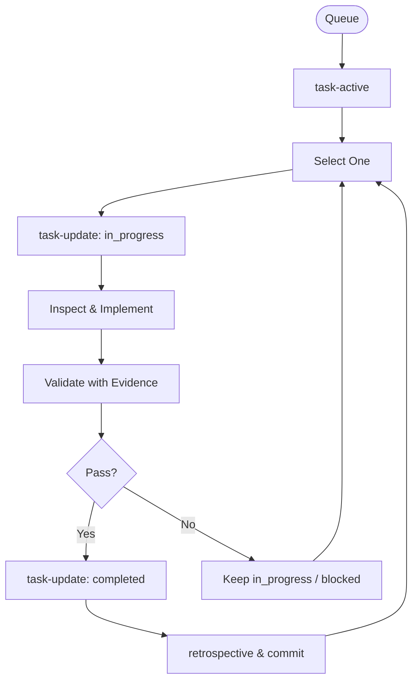

# Skill: Task Memory Executor

## Purpose
Autonomous orchestrator for processing the MCP task queue with strict validation.

## Execution Flow (STRICT)
1. **Fetch**: `task-active` (ONCE per session).
2. **Filter**: Identify stale tasks (>30m no update).
3. **Loop**: Process EXACTLY ONE task at a time.
    - **Hydrate**: `task-detail`.
    - **Start**: `task-update` (status: `in_progress`).
    - **Analyze**: Hybrid Search (70% Vector, 30% FTS5).
    - **Inspect**: Verify logic paths & call sites (Filesystem != Correctness).
    - **Validate**: Proof of behavior (Tests/Lint/Type-check).
    - **Evidence**: `task-update` (status: `completed`) with Template.
    - **Handoff**: Store critical insights via `memory-store`.
    - **Retrospective**: Invoke `learning-retrospective`.
    - **Commit**: Atomic git commit/push.
4. **Migration**: Move `backlog` subset to `pending` (max 20).

## Mandatory Validation Rules
- **Logic over Files**: Read code, trace paths, verify usage.
- **Intent match**: implementation must satisfy title/description/AC.
- **Evidence**: Comment MUST include Files, Logic verified, Checks run.
- **Transition**: `pending` → `in_progress` → `completed` (no skips).

## Completion Comment Template
```text
Completed after codebase validation.
Files inspected/modified: ...
Logic verified: ...
Checks run/Result: ...
Risks/follow-up: ...
```

## Mermaid Diagram

