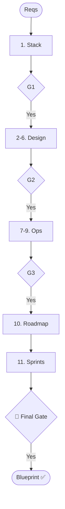

# Skill: Technical Planning Pipeline

## Purpose
Translates requirements into a technical blueprint.

## Operations

### 🔴 GATE 0 (ask_user)
- **Question**: "Start Technical Planning Pipeline (Stack, Architecture, Domain, DB, API, Roadmap, Sprints)?"

### Step Mapping

| Step | Skill | Output |
|------|-------|--------|
| 1 | `tech-stack-selection/guidelines` | Confirmed Stack |
| 2 | `architecture-planning` | Architecture Overview |
| 3 | `domain-modeling` | Domain Model |
| 4 | `database-schema-planning` | DB Schema Plan |
| 5 | `api-contract-design` | API Contract |
| 6 | `system-design-review` | Design Findings |
| 7 | `dependency-mapping` | Dependency Map |
| 8-9 | `capacity/slo-definition` | Infrastructure Plans |
| 10 | `roadmap-creation` | Product Roadmap |
| 11 | `sprint-planning` | Sprint Files |

## 🔴 GATES
- **Gate 1**: Confirm Stack.
- **Gate 2**: Approve Design (Arch/DB/API).
- **Gate 3**: Approve Operational Plans.
- **Gate Final**: Final Blueprint Approval.

## Sprint Planning Rule
Run `sprint-planning` once per sprint sequentially. Wait for confirmation after each sprint. Do NOT generate all at once.

## Mermaid Diagram

