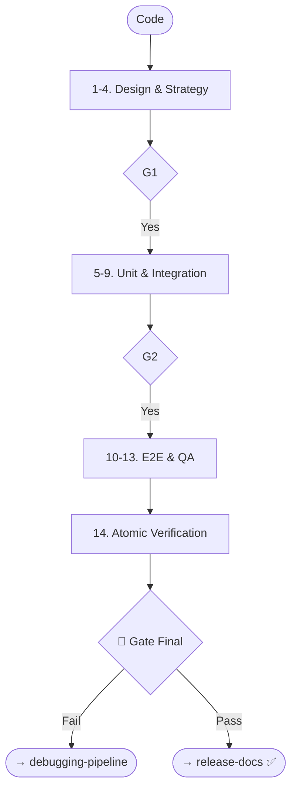

# Skill: Testing Pipeline

## Purpose
Builds and executes a layered test suite (Unit, Integration, E2E, Smoke) and QA plan.

## Operations

### 🔴 GATE 0 (ask_user)
- **Question**: "Start Testing Pipeline (Strategy, BDD, Unit/Int/E2E/Smoke, QA)?"

### Step Mapping

| Step | Skill | Output |
|------|-------|--------|
| 1 | `test-pyramid-strategy` | Test Strategy Doc |
| 2 | `bdd-scenario-writing` | BDD Scenario Set |
| 3-4 | `test-case-design` + `edge-case` | Test Case Matrix |
| 5-6 | `test-data` + `mock-stub` | Factories & Mocks |
| 7 | `unit-test-generation` | Unit Test Files |
| 8 | `integration-test-generation` | Integration Suite |
| 9 | `test-coverage-analysis` | Coverage Report |
| 10 | `e2e-test-scenario-writing` | E2E Scenarios |
| 11 | `qa-design` | QA Scenario Matrix |
| 12 | `smoke-test-suite` | Smoke Tests |
| 13 | `qa-execution` | QA Report + Bugs |
| 14 | `atomic-testing` | File-by-file Results |

## 🔴 GATES
- **Gate 1**: Approve Strategy & Case Matrix.
- **Gate 2**: Approve Unit/Integration results & Coverage.
- **Gate Final**: Full QA results review.

## Optional Steps
A11y, Security (OWASP), Performance (Load), Mutation, Chaos, DB Migration, Flaky-diagnosis.

## Mermaid Diagram

