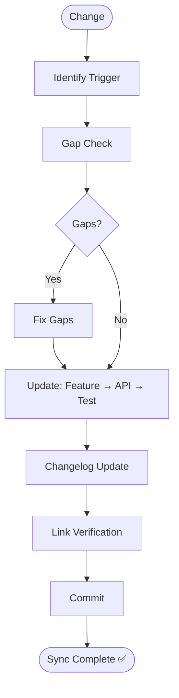

# Skill: Documentation Sync Pipeline

## Purpose
Syncs documentation after changes to features, APIs, or tests using "Change One, Check All".

## Operations

### Step 1: Identify Trigger

| Trigger | Action |
|---------|--------|
| Logic Change | Update: API, Tests, README |
| API Revise | Update: Feature Spec, Tests, Changelog |
| Bug Fix | Update: All related feature artifacts |

### Step 2: Gap Check
1. **Stories**: Every story covered in API?
2. **Coverage**: Every endpoint has Pos/Neg tests?
3. **Accuracy**: Any obsolete information remaining?

### Step 3: Update Order
1. **Feature Docs**: `module-documentation` / `project-overview`.
2. **API Docs**: `api-documentation`.
3. **Test Scenarios**: `qa-design`.
4. **Changelog**: `changelog-generation`.

## Step 4: Verify Cross-Links
Ensure all references between Feature, API, and Test documents are valid.

## Step 5: Commit
Atomic commit for doc updates: `docs(sync): update documentation for <feature>`.

## Mermaid Diagram

